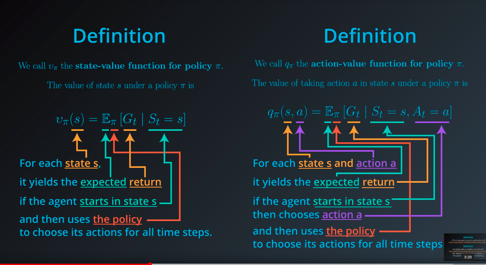
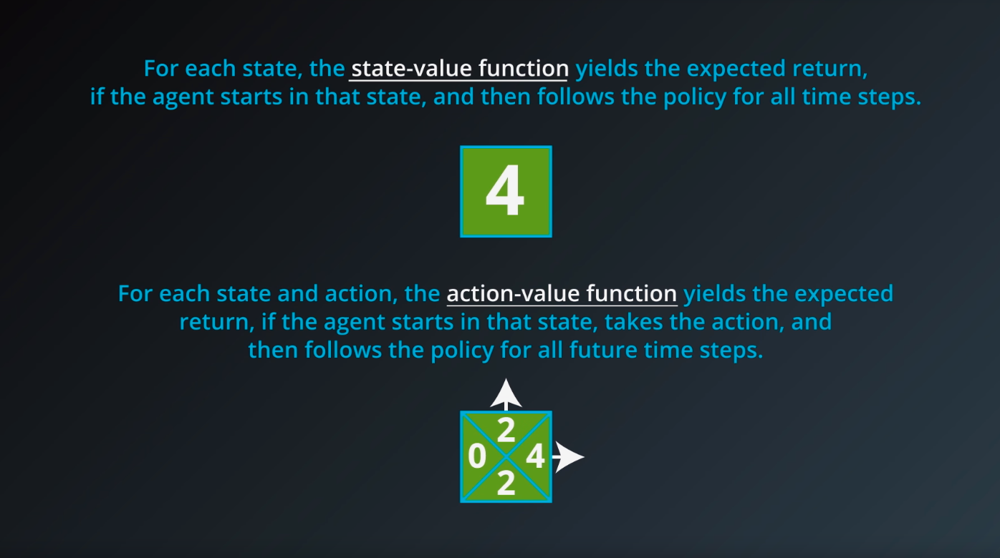
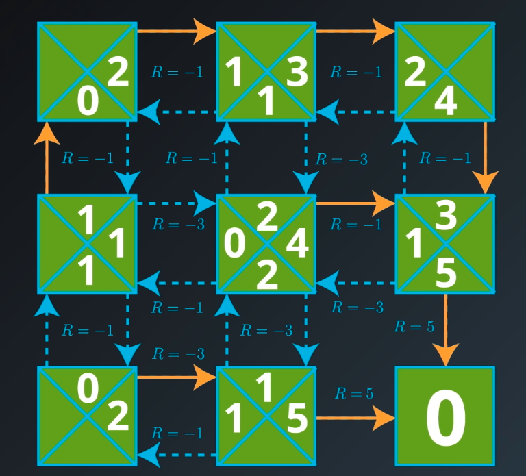
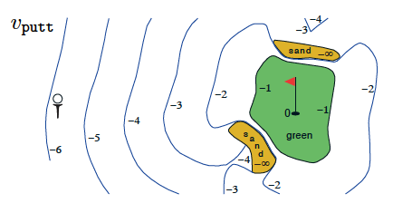

# Bellman Equations

In this gridworld example, once the agent selects an action,

- it always moves in the chosen direction (contrasting general MDPs where the agent doesn't always have complete control over what the next state will be), and
- the reward can be predicted with complete certainty (contrasting general MDPs where the reward is a random draw from a probability distribution).

In this simple example, we saw that the value of any state can be calculated as the sum of the immediate reward and the (discounted) value of the next state.

Alexis mentioned that for a general MDP, we have to instead work in terms of an *expectation*, since it's not often the case that the immediate reward and next state can be predicted with certainty. Indeed, we saw in an earlier lesson that the reward and next state are chosen according to the one-step dynamics of the MDP. In this case, where the reward *r*and next state s*′ are drawn from a (conditional) probability distribution p*(*s*′,*r*∣*s*,*a*), the **Bellman Expectation Equation (for $v_\pi$)** expresses the value of any state *s* in terms of the *expected* immediate reward and the *expected* value of the next state:

$v_\pi(s) = \text{} \mathbb{E}_\pi[R_{t+1} + \gamma v_\pi(S_{t+1})|S_t =s]$.

## Calculating the Expectation

------

In the event that the agent's policy \pi*π* is **deterministic**, the agent selects action \pi(s)*π*(*s*) when in state s*s*, and the Bellman Expectation Equation can be rewritten as the sum over two variables (*s*′ and *r*):

$v_\pi(s) = \text{} \sum_{s'\in\mathcal{S}^+, r\in\mathcal{R}}p(s',r|s,\pi(s))(r+\gamma v_\pi(s'))$

In this case, we multiply the sum of the reward and discounted value of the next state (r+\gamma v_\pi(s'))(*r*+*γ**v**π*(*s*′))by its corresponding probability p(s',r|s,\pi(s))*p*(*s*′,*r*∣*s*,*π*(*s*)) and sum over all possibilities to yield the expected value.

If the agent's policy \pi*π* is **stochastic**, the agent selects action a*a* with probability \pi(a|s)*π*(*a*∣*s*) when in state s*s*, and the Bellman Expectation Equation can be rewritten as the sum over three variables (s'*s*′, r*r*, and a*a*):

$v_\pi(s) = \text{} \sum_{s'\in\mathcal{S}^+, r\in\mathcal{R},a\in\mathcal{A}(s)}\pi(a|s)p(s',r|s,a)(r+\gamma v_\pi(s'))$

In this case, we multiply the sum of the reward and discounted value of the next state (r+\gamma v_\pi(s'))(*r*+*γ**v**π*(*s*′))by its corresponding probability \pi(a|s)p(s',r|s,a)*π*(*a*∣*s*)*p*(*s*′,*r*∣*s*,*a*) and sum over all possibilities to yield the expected value.

## There are 3 more Bellman Equations!

------

In this video, you learned about one Bellman equation, but there are 3 more, for a total of 4 Bellman equations.

> All of the Bellman equations attest to the fact that *value functions satisfy recursive relationships*.

For instance, the **Bellman Expectation Equation (for $v_\pi$)** shows that it is possible to relate the value of a state to the values of all of its possible successor states.

After finishing this lesson, you are encouraged to read about the remaining three Bellman equations in sections 3.5 and 3.6 of the [textbook](http://go.udacity.com/rl-textbook). The Bellman equations are incredibly useful to the theory of MDPs.

### State-Value Function - Policy Optimality:

​	

Action value function:

For a deterministic policy $\pi​$, holds:

$v_\pi(s) = q_\pi(s, \pi(s))$

# Summary

State-value function for golf-playing agent (Sutton and Barto, 2017)

### Policies

------

- A **deterministic policy** is a mapping $\pi: \mathcal{S}\to\mathcal{A}$. For each states*∈S, it yields the action *a*∈A that the agent will choose while in state *s*.
- A **stochastic policy** is a mapping $\pi: \mathcal{S}\times\mathcal{A}\to [0,1]$. For each state $s\in\mathcal{S}$ and action $a\in\mathcal{A}$, it yields the probability $\pi(a|s)$ that the agent chooses action *a* while in state *s*.

### State-Value Functions

------

- The **state-value function** for a policy \pi*π* is denoted v_\pi*v**π*. For each state s \in\mathcal{S}*s*∈S, it yields the expected return if the agent starts in state s*s* and then uses the policy to choose its actions for all time steps. That is, v_\pi(s) \doteq \text{} \mathbb{E}_\pi[G_t|S_t=s]*v**π*(*s*)≐E*π*[*G**t*∣*S**t*=*s*]. We refer to v_\pi(s)*v**π*(*s*) as the **value of state ss under policy \piπ**.
- The notation \mathbb{E}_\pi[\cdot]E*π*[⋅] is borrowed from the suggested textbook, where \mathbb{E}_\pi[\cdot]E*π*[⋅] is defined as the expected value of a random variable, given that the agent follows policy \pi*π*.

### Bellman Equations

------

- The **Bellman expectation equation for v_\pivπ** is:

  $v_\pi(s) = \text{} \mathbb{E}_\pi[R_{t+1} + \gamma v_\pi(S_{t+1})|S_t =s]$

### Optimality

------

- A policy \pi'*π*′ is defined to be better than or equal to a policy \pi*π* if and only if v_{\pi'}(s) \geq v_\pi(s)*v**π*′(*s*)≥*v**π*(*s*) for all s\in\mathcal{S}*s*∈S.
- An **optimal policy \pi_\*π∗** satisfies \pi_* \geq \pi*π*∗≥*π* for all policies \pi*π*. An optimal policy is guaranteed to exist but may not be unique.
- All optimal policies have the same state-value function v_**v*∗, called the **optimal state-value function**.

### Action-Value Functions

------

- The **action-value function** for a policy \pi*π* is denoted q_\pi*q**π*. For each state s \in\mathcal{S}*s*∈S and action a \in\mathcal{A}*a*∈A, it yields the expected return if the agent starts in state s*s*, takes action a*a*, and then follows the policy for all future time steps. That is, q_\pi(s,a) \doteq \mathbb{E}_\pi[G_t|S_t=s, A_t=a]*q**π*(*s*,*a*)≐E*π*[*G**t*∣*S**t*=*s*,*A**t*=*a*]. We refer to q_\pi(s,a)*q**π*(*s*,*a*) as the **value of taking action aa in state ss under a policy \piπ** (or alternatively as the **value of the state-action pair s, as,a**).
- All optimal policies have the same action-value function q_**q*∗, called the **optimal action-value function**.

### Optimal Policies

------

- Once the agent determines the optimal action-value function q_**q*∗, it can quickly obtain an optimal policy \pi_**π*∗ by setting \pi_*(s) = \arg\max_{a\in\mathcal{A}(s)} q_*(s,a)*π*∗(*s*)=argmax*a*∈A(*s*)*q*∗(*s*,*a*).