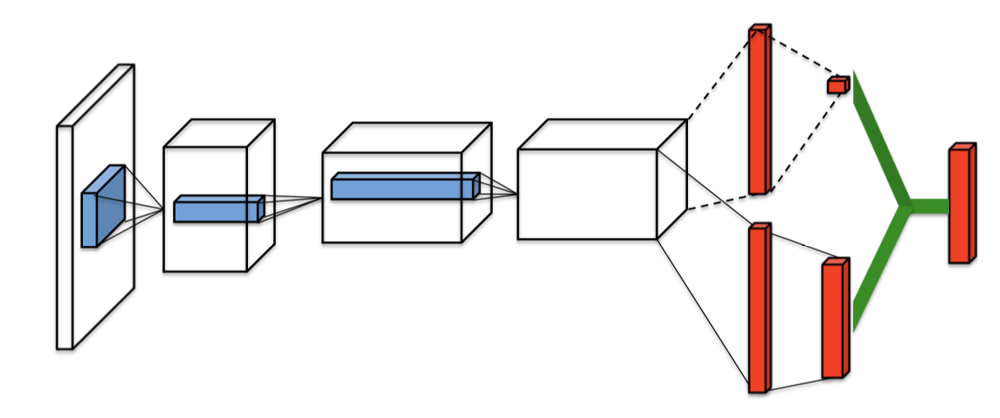

# Deep Q-Networks

As you'll learn in this lesson, the Deep Q-Learning algorithm represents the optimal action-value function $q_*​$ as a neural network (instead of a table).

Unfortunately, reinforcement learning is [notoriously unstable](http://citeseerx.ist.psu.edu/viewdoc/download?doi=10.1.1.73.3097&rep=rep1&type=pdf) when neural networks are used to represent the action values. In this lesson, you'll learn all about the Deep Q-Learning algorithm, which addressed these instabilities by using **two key features**:

- Experience Replay
- Fixed Q-Targets

## Additional References

------

- Riedmiller, Martin. "Neural fitted Q iteration–first experiences with a data efficient neural reinforcement learning method." European Conference on Machine Learning. Springer, Berlin, Heidelberg, 2005. <http://ml.informatik.uni-freiburg.de/former/_media/publications/rieecml05.pdf>
- Mnih, Volodymyr, et al. "Human-level control through deep reinforcement learning." Nature518.7540 (2015): 529. <http://www.davidqiu.com:8888/research/nature14236.pdf>

Atari Games:

The Q-value approximation network produces q values for all actions.

####  DeepMind leveraged a **Deep Q-Network (DQN)** to build the Deep Q-Learning algorithm that learned to play many Atari video games better than humans

- The DQN takes the state as input, and returns the corresponding predicted action values for each possible game action.
- For each atari game, the DQN was trained from scratch

## Experience Replay (coping with correlation type 1)

Saving tuples of SARS and going over it better usage of experience.

The reason that these tuples are sampled is to deal with the problem that temporally close SA can be correlated which creates oscillations and divergence (?). Randomly sampling the history helps deal with this problem.

Experience replay:

- Experience replay is based on the idea that we can learn better, if we do multiple passes over the same experience.
- Experience replay is used to generate uncorrelated experience data for online training of deep RL agents.

## Fixed Q-Targets  (coping with correlation type 2)

The gradient descent update rule:

This update rule is like chasing a moving target. Hence the following solution:

We freeze $w$ by saving its latest value into $w^-$ learn for a few steps and so on. This decouples the target from the parameters. Makes the algorithm much more stable and less likely to diverge or fall into oscillations.

## Summary

------

In Q-Learning, we **update a guess with a guess**, and this can potentially lead to harmful correlations. To avoid this, we can update the parameters *w* in the network $\hat{q}$ to better approximate the action value corresponding to state *S* and action *A* with the following update rule:

where w^-*w*− are the weights of a separate target network that are not changed during the learning step, and (*S*, *A*, *R*, *S*′) is an experience tuple.

**Note**: Ever wondered how the example in the video would look in real life? See: [Carrot Stick Riding](https://www.youtube.com/watch?v=-PVFBGN_zoM).

The following are true:

- The Deep Q-Learning algorithm uses two separate networks with identical architectures.
- The target Q-Network's weights are updated less often (or more slowly) than the primary Q-Network.
- Without fixed Q-targets, we would encounter a harmful form of correlation, whereby we shift the parameters of the network based on a constantly moving target.

## Deep Q-Learning Algorithm

Its recommended to read the [research paper](https://storage.googleapis.com/deepmind-media/dqn/DQNNaturePaper.pdf) that introduces the Deep Q-Learning algorithm.

Tips for reading papers: [tips](https://violentmetaphors.com/2013/08/25/how-to-read-and-understand-a-scientific-paper-2/)

The paper pseudo code:

**Coding Exercise:** Lunar Lander (gym)

## Deep Q-Learning Improvements

Several improvements to the original Deep Q-Learning algorithm have been suggested. Three of the more prominent ones.

#### Double DQN

Deep Q-Learning [tends to overestimate](https://www.ri.cmu.edu/pub_files/pub1/thrun_sebastian_1993_1/thrun_sebastian_1993_1.pdf) action values. [Double Q-Learning](https://arxiv.org/abs/1509.06461) has been shown to work well in practice to help with this.

#### Prioritized Experience Replay

Deep Q-Learning samples experience transitions *uniformly* from a replay memory. [Prioritized experienced replay](https://arxiv.org/abs/1511.05952) is based on the idea that the agent can learn more effectively from some transitions than from others, and the more important transitions should be sampled with higher probability.

#### Dueling DQN

Currently, in order to determine which states are (or are not) valuable, we have to estimate the corresponding action values *for each action*. However, by replacing the traditional Deep Q-Network (DQN) architecture with a [dueling architecture](https://arxiv.org/abs/1511.06581), we can assess the value of each state, without having to learn the effect of each action.

### Double DQN

This argmax at the beginning of the learning process selects the maximum based on noise and leads to over estimation of Q-values. 

The original suggested solution is maintaining 2 q functions, at each iteration randomly pick one of them for selecting action (using argmax) and with the other evaluate the s-a:

With fixed Q-targets (as described above) the $Q$ and $Q^{-}$ weights are separated enough to solve this problem as well.

 

#### Notes

You can read more about Double DQN (DDQN) by perusing this [research paper](https://arxiv.org/abs/1509.06461).

If you'd like to dig deeper into how Deep Q-Learning overestimates action values, please read this [research paper](https://www.ri.cmu.edu/pub_files/pub1/thrun_sebastian_1993_1/thrun_sebastian_1993_1.pdf).

### Prioritized Experience Replay

This method changes the probability of choosing a experience tuple from random distribution to $\delta$ based distribution. $\delta$ - the TD error. When a tuple is picked, then we would update its TD error with new estimate of $q$. The method reduces the number of batch updates needed in order to learn a value function.  

Some improvements include:

1. if we by chance had a small TD error, the tuple will not be chosen. Solution add $e$.
2. It might happen that a subset of experience tuples would be "greedily" chosen and therefore over fit. Solution add $a$. $a=1\rightarrow priorities$ and $a=0\rightarrow random$.

Since the update rule assumes expected value from all experience the update rule needs to be modified to take into account the probability of selecting experiences. Hence the modified update rule.

$b$ - another hyper-parameter that should increase towards 1 when reaching the end of optimization since $q$ has almost converged and that is the time to emphasize the more important experience.

 

#### Notes

You can read more about prioritized experience replay by perusing this [research paper](https://arxiv.org/abs/1511.05952).

## Dueling DQN

Sine values of most states don't vary across actions this approach branches after the conv-nets into two braches:

1. Estimating the value function
2. Estimating the advantage-values function

This technique resulted in significantly outperforming vanilla-dqns.

#### Notes

You can read more about Dueling DQN by perusing this [research paper](https://arxiv.org/abs/1511.06581) (or 
[here]: typoraImages/Part2/DuelingNetworkArchForDRL.pdf	"Dueling DRL Arch"

). 

## Rainbow

So far, you've learned about three extensions to the Deep Q-Networks (DQN) algorithm:

- Double DQN (DDQN)
- Prioritized experience replay
- Dueling DQN

But these aren't the only extensions to the DQN algorithm! Many more extensions have been proposed, including:

- Learning from [multi-step bootstrap targets](https://arxiv.org/abs/1602.01783) (as in A3C - *you'll learn about this in the next part of the nanodegree*)
- [Distributional DQN](https://arxiv.org/abs/1707.06887)
- [Noisy DQN](https://arxiv.org/abs/1706.10295)

Each of the six extensions address a **different** issue with the original DQN algorithm.

Researchers at Google DeepMind recently tested the performance of an agent that incorporated all six of these modifications. The corresponding algorithm was termed [Rainbow](https://arxiv.org/abs/1710.02298).

It outperforms each of the individual modifications and achieves state-of-the-art performance on Atari 2600 games!

## In Practice

------

In mid-2018, OpenAI held [a contest](https://contest.openai.com/), where participants were tasked to create an algorithm that could learn to play the [Sonic the Hedgehog](https://en.wikipedia.org/wiki/Sonic_the_Hedgehog) game. The participants were tasked to train their RL algorithms on provided game levels; then, the trained agents were ranked according to their performance on previously unseen levels.

Thus, the contest was designed to assess the ability of trained RL agents to generalize to new tasks.

One of the provided baseline algorithms was **Rainbow DQN**. If you'd like to play with this dataset and run the baseline algorithms, you're encouraged to follow the [setup instructions](https://contest.openai.com/2018-1/details/).

**Baseline results on the Retro Contest:**

