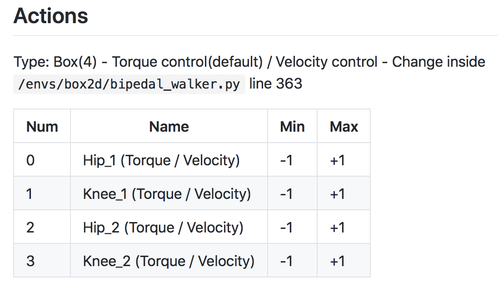

# 2. Introduction to Policy-Based Methods

In this lesson, you'll learn all about **policy-based methods**. Watch the video below to learn what policy-based methods are, and how they differ from value-based methods!

example of value based method (cart-pole):

From the above trained network we could obtain a value for each action at a given state and then choose a policy (e-greedy).

In policy-based methods the following network is used:

The output is probability to sample from when choosing an action.

**<u>Note:</u>** A valid activation function for the output layer is softmax.

softmax =

In this lesson we will learn many different ways to optimize these weights.

## What about continuous action spaces?

The CartPole environment has a discrete action space. So, how do we use a neural network to approximate a policy, if the environment has a continuous action space?

As you learned above, in the case of **discrete** action spaces, the neural network has one node for each possible action.

For **continuous** action spaces, the neural network has one node for each action entry (or index). For example, consider the action space of the [bipedal walker](https://github.com/openai/gym/wiki/BipedalWalker-v2) environment, shown in the figure below.

In this case, any action is a vector of four numbers, so the output layer of the policy network will have four nodes.

Since every entry in the action must be a number between -1 and 1, we will add a [tanh activation function](https://pytorch.org/docs/stable/nn.html#torch.nn.Tanh) to the output layer.

As another example, consider the [continuous mountain car](https://github.com/openai/gym/wiki/MountainCarContinuous-v0) benchmark. The action space is shown in the figure below. Note that for this environment, the action must be a value between -1 and 1.

An appropriate output layer for the policy would be a layer of size: 1 and  tanh as the activation function.

## Maximizing Expected Return (denoted as $J$) in PBM

**<u>Local Minima</u>**

Hill Climbing is a relatively simple algorithm that the agent can use to gradually improve the weights $\theta$ in its policy network while interacting with the environment.

Note, however, that it's **not** guaranteed to always yield the weights of the optimal policy. This is because we can easily get stuck in a local maximum. In this lesson, you'll learn about some policy-based methods that are less prone to this.

### Hill Climbing Pseudocode

### What's the difference between G and J?

You might be wondering: what's the difference between the return that the agent collects in a single episode (G, *from the pseudocode above*) and the expected return J?

Well ... in reinforcement learning, the goal of the agent is to find the value of the policy network weights \theta*θ* that maximizes **expected** return, which we have denoted by J.

In the hill climbing algorithm, the values of \theta*θ* are evaluated according to how much return G*G* they collected in a **single episode**. To see that this might be a little bit strange, note that due to randomness in the environment (and the policy, if it is stochastic), it is highly likely that if we collect a second episode with the same values for $\theta$, we'll likely get a different value for the return *G*. Because of this, the (sampled) return G is not a perfect estimate for the expected return J, but it often turns out to be **good enough** in practice.

<u>*Note*</u>: We refer to the general class of approaches that find $\arg\max_{\theta}J(\theta)$ through randomly perturbing the most recent best estimate as **stochastic policy search**. Likewise, we can refer to *J* as an **objective function**, which just refers to the fact that we'd like to *maximize* it!

Simulated Annealing: is reducing the additive gaussian noise as we get better and better policies. If no better policies are found then increasing the scale of the gaussian noise should land a policy out of the local minima. This is called also **adaptive noise scaling**.

# More Black-Box Optimization

All of the algorithms that you’ve learned about in this lesson can be classified as **black-box optimization** techniques.

**Black-box** refers to the fact that in order to find the value of \theta*θ* that maximizes the function $J = J(\theta)$, we need only be able to estimate the value of *J* at any potential value of $\theta$.

That is, both hill climbing and steepest ascent hill climbing don't know that we're solving a reinforcement learning problem, and they do not care that the function we're trying to maximize corresponds to the expected return.

These algorithms only know that for each value of $\theta$, there's a corresponding **number**. We know that this **number** corresponds to the return obtained by using the policy corresponding to $\theta$ to collect an episode, but the algorithms are not aware of this. To the algorithms, the way we evaluate $\theta$ is considered a black box, and they don't worry about the details. The algorithms only care about finding the value of $\theta$ that will maximize the number that comes out of the black box.

**cross-entropy method** and [evolution strategies](https://blog.openai.com/evolution-strategies/):

Cross-entropy method averages the top policies at each step to produce the next policy.

Evolution strategies takes a weighted sum of the candidate policies.

**<u>Coding exercise</u>**

1. cross-entropy method (CEM.ipynb)
2. hill-climbing with adaptive noise scaling (Hill_Climbing.ipynb)

## OpenAI Request for Research

So far in this lesson, you have learned about many black-box optimization techniques for finding the optimal policy. Run each algorithm for many random seeds, to test stability.

Take the time now to implement some of them, and compare performance on OpenAI Gym's `CartPole-v0` environment.

> **Note**: This suggested exercise is completely optional.

Once you have completed your analysis, you're encouraged to write up your own blog post that responds to [OpenAI's Request for Research](https://openai.com/requests-for-research/#cartpole)! (*This request references policy gradient methods. You'll learn about policy gradient methods in the next lesson.*)

Implement (vanilla) hill climbing and steepest ascent hill climbing, both with simulated annealing and adaptive noise scaling.

If you also want to compare the performance to evolution strategies, you can find a well-written implementation [here](https://github.com/alirezamika/evostra). To see how to apply it to an OpenAI Gym task, check out [this repository](https://github.com/alirezamika/bipedal-es).

To see one way to structure your analysis, check out [this blog post](http://kvfrans.com/simple-algoritms-for-solving-cartpole/), along with the [accompanying code](https://github.com/kvfrans/openai-cartpole).

For instance, you will likely find that hill climbing is very unstable, where the number of episodes that it takes to solve `CartPole-v0` varies greatly with the random seed. (*Check out the figure below!*)

Histogram of number of episodes needed to solve CartPole with hill climbing:

## Why Policy-Based Methods?

In this lesson, you've learned about several policy-based methods. But why do we need policy-based methods at all, when value-based methods work so well?

#### 3 arguments to consider:

* simplicity
* Stochastic Policies
* Continuous action space

**Simplicity:**
We truly only need the policy and not the value function.
For example, large portions of the state space may have the same value. Formulating the policy in this manner ($\pi:s\rightarrow a$) allows generalizations when possible and lets us focus more on the complicated regions of the state space.

**Stochastic Policies:**
Unlike value based methods, policy based methods can learn true stochastic policies.

**Truly Stochastic policies - Intuition:** in the above picture - the changing state (red-blue rectangles) influences the variety of the extracted balls. In contrast, the $\epsilon$-greedy policy does insert some randomness but not in a way. For example, in the rock scissors paper game, it turns out that the optimal policy (that cant be exploited by an opponent) is choosing an action uniformly.

Another place that stochastic policies are useful is in aliased stated (states that are perceived to be the same \ partially observable).

Aliased states:

In the above game, sensing tile color and walls in the vicinity of your current cell, you net to get a banana. Since the two gray cells are exactly the same (state wise), a value based method would need to assign a equal action-value for both gray cells. This means that in $\epsilon$-greedy policy, the agent would get stuck oscillating between the gray and outer most white cell (either left or right). In this case the optimal policy is a stochastic one which uniformly chooses left\right in the grey cells.

**Bottom line:** A value-based approach tends to learn a deterministic (or near deterministic) policy while the policy-based approach can learn the desired stochastic policy.

**Continuous action space:**

In a value-based approach out output is a value for each action. If the action is continuous, then choosing the best action given a continuous value function is an optimization problem in its self (which could be non trivial, also in descrete but high dimensional action space). Mapping the state directly to a policy might be more complex, buy would reduce the time needed to act.

## Summary

------

### Policy-Based Methods

- With **value-based methods**, the agent uses its experience with the environment to maintain an estimate of the optimal action-value function. The optimal policy is then obtained from the optimal action-value function estimate.
- **Policy-based methods** directly learn the optimal policy, without having to maintain a separate value function estimate.

### Policy Function Approximation

- In dep reinforcement learning, it is common to represent the policy with a neural network.
  - This network takes the environment state as **input**.
  - If the environment has discrete actions, the **output** layer has a node for each possible action and contains the probability that the agent should select each possible action.
- The weights in this neural network are initially set to random values. Then, the agent updates the weights as it interacts with (*and learns more about*) the environment.

### More on the Policy

- Policy-based methods can learn either stochastic or deterministic policies, and they can be used to solve environments with either finite or continuous action spaces.

### Hill Climbing

- **Hill climbing** is an iterative algorithm that can be used to find the weights \theta*θ* for an optimal policy.
- At each iteration,
  - We slightly perturb the values of the current best estimate for the weights \theta_{best}*θ**b**e**s**t*, to yield a new set of weights.
  - These new weights are then used to collect an episode. If the new weights \theta_{new}*θ**n**e**w* resulted in higher return than the old weights, then we set \theta_{best} \leftarrow \theta_{new}*θ**b**e**s**t*←*θ**n**e**w*.

### Beyond Hill Climbing

- **Steepest ascent hill climbing** is a variation of hill climbing that chooses a small number of neighboring policies at each iteration and chooses the best among them.
- **Simulated annealing** uses a pre-defined schedule to control how the policy space is explored, and gradually reduces the search radius as we get closer to the optimal solution.
- **Adaptive noise scaling** decreases the search radius with each iteration when a new best policy is found, and otherwise increases the search radius.

### More Black-Box Optimization

- The **cross-entropy method** iteratively suggests a small number of neighboring policies, and uses a small percentage of the best performing policies to calculate a new estimate.
- The **evolution strategies** technique considers the return corresponding to each candidate policy. The policy estimate at the next iteration is a weighted sum of all of the candidate policies, where policies that got higher return are given higher weight.

### Why Policy-Based Methods?

- There are three reasons why we consider policy-based methods:
  1. **Simplicity**: Policy-based methods directly get to the problem at hand (estimating the optimal policy), without having to store a bunch of additional data (i.e., the action values) that may not be useful.
  2. **Stochastic policies**: Unlike value-based methods, policy-based methods can learn true stochastic policies.
  3. **Continuous action spaces**: Policy-based methods are well-suited for continuous action spaces.