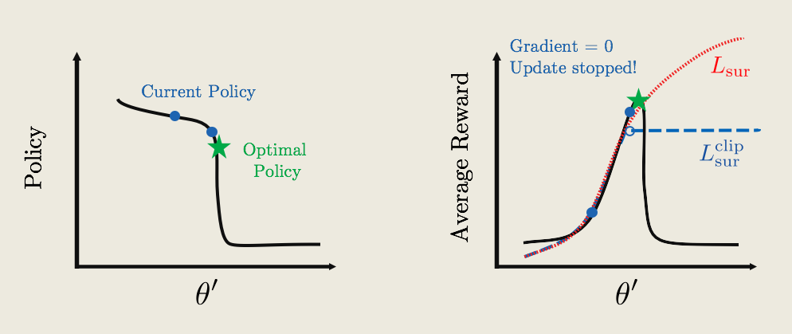

# Proximal Policy Optimization


## Lesson Preview

State-of-the-art RL algorithms contain many important tweaks in addition to simple value-based or policy-based methods. One of these key improvements is called Proximal Policy Optimization (PPO) -- also closely related to Trust Region Policy Optimization (TRPO). It has allowed faster and more stable learning. From developing agile robots, to creating expert level gaming AI, PPO has proven useful in a wide domain of applications, and has become part of the standard toolkits in complicated learning environments.

In this lesson, we will first review the most basic policy gradient algorithm -- REINFORCE, and discuss issues associated with the algorithm. We will get an in-depth understanding of why these problems arise, and find ways to fix them. The solutions will lead us to PPO. Our lesson will focus on learning the intuitions behind why and how PPO improves learning, and implement it to teach a computer to play Atari-Pong, using only the pixels as input.

*The idea of PPO was published by the team at OpenAI, and you can read their paper through this [link](https://arxiv.org/abs/1707.06347)*


## Beyond REINFORCE

Here, we briefly review key ingredients of the REINFORCE algorithm.

REINFORCE works as follows: First, we initialize a random policy $\pi_\theta(a;s)$, and using the policy we collect a trajectory -- or a list of (state, actions, rewards) at each time step:
$$
s_1, a_1, r_1, s_2, a_2, r_2, ...
$$
Second, we compute the total reward of the trajectory $R=r_1+r_2+r_3+...$, and compute an estimate of the gradient of the expected reward, *g*:
$$
g = R \sum_t \nabla_\theta \log\pi_\theta(a_t|s_t)
$$
Third, we update our policy using gradient ascent with learning rate $\alpha$:
$$
\theta \leftarrow \theta + \alpha g
$$
The process then repeats.


What are the main problems of REINFORCE? There are three issues:

1. The update process is very **inefficient**! We run the policy once, update once, and then throw away the trajectory.
2. The gradient estimate *g* is very **noisy**. By chance the collected trajectory may not be representative of the policy.
3. There is no clear **credit assignment**. A trajectory may contain many good/bad actions and whether these actions are reinforced depends only on the final total output.

In the following concepts, we will go over ways to improve the REINFORCE algorithm and resolve all 3 issues. All of the improvements will be utilized and implemented in the PPO algorithm.


## Noise Reduction

The way we optimize the policy is by maximizing the average rewards $U(\theta)$. To do that we use stochastic gradient ascent. Mathematically, the gradient is given by an average over all the possible trajectories,
$$
\nabla_\theta U(\theta) = \overbrace{\sum_\tau P(\tau; \theta)}^{ \begin{matrix} \scriptsize\textrm{average over}\\ \scriptsize\textrm{all trajectories} \end{matrix} } \underbrace{\left( R_\tau \sum_t \nabla_\theta \log \pi_\theta(a_t^{(\tau)}|s_t^{(\tau)}) \right)}_{ \textrm{only one is sampled} }
$$
There could easily be well over millions of trajectories for simple problems, and infinite for continuous problems.

For practical purposes, we simply take one trajectory to compute the gradient, and update our policy. So a lot of times, the result of a sampled trajectory comes down to chance, and doesn't contain that much information about our policy. How does learning happen then? The hope is that after training for a long time, the tiny signal accumulates.

The easiest option to reduce the noise in the gradient is to simply sample more trajectories! Using distributed computing, we can collect multiple trajectories in parallel, so that it won’t take too much time. Then we can estimate the policy gradient by averaging across all the different trajectories
$$
\left. \begin{matrix} s^{(1)}_t, a^{(1)}_t, r^{(1)}_t\\[6pt] s^{(2)}_t, a^{(2)}_t, r^{(2)}_t\\[6pt] s^{(3)}_t, a^{(3)}_t, r^{(3)}_t\\[6pt] \vdots \end{matrix} \;\; \right\}\!\!\!\! \rightarrow g = \frac{1}{N}\sum_{i=1}^N R_i \sum_t\nabla_\theta \log \pi_\theta(a^{(i)}_t | s^{(i)}_t)
$$

## Rewards Normalization

There is another bonus for running multiple trajectories: we can collect all the total rewards and get a sense of how they are distributed.

In many cases, the distribution of rewards shifts as learning happens. Reward = 1 might be really good in the beginning, but really bad after 1000 training episode.

Learning can be improved if we normalize the rewards, where $\mu$ is the mean, and $\sigma$ the standard deviation.
$$
R_i \leftarrow \frac{R_i -\mu}{\sigma} \qquad \mu = \frac{1}{N}\sum_i^N R_i \qquad \sigma = \sqrt{\frac{1}{N}\sum_i (R_i - \mu)^2}
$$

(when all the $R_i$ are the same, $\sigma =0$, we can set all the normalized rewards to 0 to avoid numerical problems)

This batch-normalization technique is also used in many other problems in AI (e.g. image classification), where normalizing the input can improve learning.

Intuitively, normalizing the rewards roughly corresponds to picking half the actions to encourage/discourage, while also making sure the steps for gradient ascents are not too large/small.


## Credit Assignment

Going back to the gradient estimate, we can take a closer look at the total reward *R*, which is just a sum of reward at each step $R=r_1+r_2+...+r_{t-1}+r_t+...$
$$
g=\sum_t (...+r_{t-1}+r_{t}+...)\nabla_{\theta}\log \pi_\theta(a_t|s_t)
$$
Let’s think about what happens at time-step *t*. Even before an action is decided, the agent has already received all the rewards up until step t-1*t*−1. So we can think of that part of the total reward as the reward from the past. The rest is denoted as the future reward.
$$
(\overbrace{...+r_{t-1}}^{\cancel{R^{\rm past}_t}}+ \overbrace{r_{t}+...}^{R^{\rm future}_t})
$$
Because we have a Markov process, the action at time-step *t* can only affect the future reward, so the past reward shouldn’t be contributing to the policy gradient. So to properly assign credit to the action $a_t$, we should ignore the past reward. So a better policy gradient would simply have the future reward as the coefficient .
$$
g=\sum_t R_t^{\rm future}\nabla_{\theta}\log \pi_\theta(a_t|s_t)
$$


**Notes on Gradient Modification**

You might wonder, why is it okay to just change our gradient? Wouldn't that change our original goal of maximizing the expected reward?

It turns out that mathematically, ignoring past rewards might change the gradient for each specific trajectory, but it doesn't change the **averaged** gradient. So even though the gradient is different during training, on average we are still maximizing the average reward. In fact, the resultant gradient is less noisy, so training using future reward should speed things up!


## Policy Gradient Quiz

Suppose we are training an agent to play a computer game. There are only two possible action:

0 = Do nothing, 1 = Move

There are three time-steps in each game, and our policy is completely determined by one parameter \theta*θ*, such that the probability of "moving" is $\theta$, and the probability of doing nothing is $1-\theta$

Initially $\theta=0.5$. Three games are played, the results are:

Game 1: actions: (1,0,1) rewards: (1,0,1)
Game 2: actions: (1,0,0) rewards: (0,0,1)
Game 3: actions: (0,1,0) rewards: (1,0,1)


**Question 1:** What are the future rewards for the first game?
Recall the results for game 1 are: actions: (1,0,1) rewards: (1,0,1)

Answer to Q1: (2,1,1)

**Question 2:** What is the policy gradient computed from the second game, using future rewards?
actions: (1,0,0) rewards: (0,0,1)

Make sure you are using the fact that $\pi_\theta(1|s_t) = \theta$, and $\pi_{\theta}(0|s_t) = 1-\theta$.  The future rewards are computed to be (1,1,1). 
$$
\sum_t \nabla_{\theta} \log\pi_{\theta}(a_t | s_t) R_{t}^{\rm future} = \sum_t \frac{\nabla_{\theta} \pi_{\theta}(a_t | s_t)}{\pi_{\theta}(a_t | s_t)} R_{t}^{\rm future}=
$$

$$
\frac{\nabla_{\theta} \pi_{\theta}(a_0 | s_0)}{\pi_{\theta}(a_0 | s_0)} R_{0}^{future}+
\frac{\nabla_{\theta} \pi_{\theta}(a_1 | s_1)}{\pi_{\theta}(a_1 | s_1)} R_{1}^{future}+
\frac{\nabla_{\theta} \pi_{\theta}(a_2 | s_2)}{\pi_{\theta}(a_2 | s_2)} R_{2}^{future}=
$$

$$
\frac{\nabla_{\theta} \theta}{\theta} 1+
\frac{\nabla_{\theta} (1-\theta)}{1-\theta} 1+
\frac{\nabla_{\theta} (1-\theta)}{1-\theta} 1=\\
\frac{1}{0.5} 1+
\frac{-1}{0.5} 1+
\frac{-1}{0.5} 1=-2
$$

Each time an action 1 is taken, it contributes $+1/0.5 = +2$ to the policy gradient. Whereas every time an action 0 is taken, it contributes $-1/0.5 = -2$ to the gradient. This is be because $\pi_{\theta}(0|s)= 1-\theta$

**Question 3:** In game 3 (reminder - actions: (0,1,0) rewards: (1,0,1)) the future rewards are computed to be (2,1,1)
$$
\frac{\nabla_{\theta} (1-\theta)}{1-\theta} 2+
\frac{\nabla_{\theta} \theta}{\theta} 1+
\frac{\nabla_{\theta} (1-\theta)}{1-\theta} 1=\\
\frac{-1}{0.5} 2+\frac{1}{0.5} 1+\frac{-1}{0.5} 1=-2
$$
Therefore, the following is correct:

- The contribution to the gradient from the second and third steps cancel each other
- The computed policy gradient from this game is negative
- Using the total reward vs future reward give the same policy gradient in this game


## Coding exercise - Pong with REINFORCE


## Importance Sampling

#### 1. Policy Update in REINFORCE

Let’s go back to the REINFORCE algorithm. We start with a policy, $\pi_\theta$, then using that policy, we generate a trajectory (or multiple ones to reduce noise) $(s_t, a_t, r_t)$. Afterward, we compute a policy gradient, $g$, and update $\theta' \leftarrow \theta + \alpha g$.

At this point, the trajectories we’ve just generated are simply thrown away. If we want to update our policy again, we would need to generate new trajectories once more, using the updated policy.

You might ask, why is all this necessary? It’s because we need to compute the gradient for the current policy, and to do that the trajectories need to be representative of the current policy.

But this sounds a little wasteful. What if we could somehow recycle the old trajectories, by modifying them so that they are representative of the new policy? So that instead of just throwing them away, we recycle them!

Then we could just reuse the recycled trajectories to compute gradients, and to update our policy, again, and again. This would make updating the policy a lot more efficient. So, how exactly would that work?


2. Importance Sampling

This is where importance sampling comes in. Let’s look at the trajectories we generated using the policy $\pi_\theta$. It had a probability $P(\tau;\theta)$, to be sampled.

Now Just by chance, the same trajectory can be sampled under the new policy, with a different probability $P(\tau;\theta')$.

Imagine we want to compute the average of some quantity, say $f(\tau)$ (under the new policy). We could simply generate trajectories from the new policy, compute $f(\tau)$ and average them.

Mathematically, this is equivalent to adding up all the $f(\tau)$, weighted by a probability of sampling each trajectory under the new policy.
$$
\sum_\tau P(\tau;\theta') f(\tau)
$$
Now we could modify this equation, by multiplying and dividing by the same number, P(\tau;\theta)*P*(*τ*;*θ*) and rearrange the terms.
$$
\sum_\tau \overbrace{P(\tau;\theta)}^{ \begin{matrix} \scriptsize \textrm{sampling under}\\ \scriptsize \textrm{old policy } \pi_\theta \end{matrix} } \overbrace{\frac{P(\tau;\theta')}{P(\tau;\theta)}}^{ \begin{matrix} \scriptsize \textrm{re-weighting}\\ \scriptsize \textrm{factor} \end{matrix} } f(\tau)
$$

It doesn’t look we’ve done much. But written in this way, we can reinterpret the first part as the coefficient for sampling under the old policy, with an extra re-weighting factor, in addition to just averaging.

Intuitively, this tells us we can use old trajectories for computing averages for new policy, as long as we add this extra re-weighting factor, that takes into account how under or over–represented each trajectory is under the new policy compared to the old one.

The same tricks are used frequently across statistics, where the re-weighting factor is included to un-bias surveys and voting predictions.


#### 3. The re-weighting factor

Now Let’s a closer look at the re-weighting factor.
$$
\frac{P(\tau;\theta')}{P(\tau;\theta)} =\frac {\pi_{\theta'}(a_1|s_1)\, \pi_{\theta'}(a_2|s_2)\, \pi_{\theta'}(a_3|s_3)\,...} {\pi_\theta(a_1|s_1) \, \pi_\theta(a_2|s_2)\, \pi_\theta(a_2|s_2)\, ...}
$$

Because each trajectory contains many steps, the probability contains a chain of products of each policy at different time-step.

This formula is a bit complicated. But there is a bigger problem. When some of the policy gets close to zero, the re-weighting factor can become very close to zero, or worse, very close to 1 over 0 which diverges to infinity.

When this happens, the re-weighting trick becomes unreliable. So, In practice, we want to make sure the re-weighting factor is not too far from 1 when we utilize importance sampling.


## PPO Part 1: The Surrogate Function

#### Re-weighting the Policy Gradient

Suppose we are trying to update our current policy, $\pi_{\theta'}$. To do that, we need to estimate a gradient, *g*. But we only have trajectories generated by an older policy $\pi_{\theta}$. How do we compute the gradient then?

Mathematically, we could utilize importance sampling. The answer just what a normal policy gradient would be, times a re-weighting factor $P(\tau;\theta')/P(\tau;\theta)$:
$$
g=\frac{P(\tau; \theta')}{P(\tau; \theta)}\sum_t \frac{\nabla_{\theta'} \pi_{\theta'}(a_t|s_t)}{\pi_{\theta'}(a_t|s_t)}R_t^{\rm future}
$$
We can rearrange these equations, and the re-weighting factor is just the product of all the policy across each step -- I’ve picked out the terms at time-step t*t* here. We can cancel some terms, but we're still left with a product of the policies at different times, denoted by "......".
$$
g=\sum_t \frac{...\, \cancel{\pi_{\theta'}(a_t|s_t)} \,...} {...\,\pi_{\theta}(a_t|s_t)\,...} \, \frac{\nabla_{\theta'} \pi_{\theta'}(a_t|s_t)}{\cancel{\pi_{\theta'}(a_t|s_t)}}R_t^{\rm future}
$$

Can we simplify this expression further? This is where proximal policy comes in. If the old and current policy is close enough to each other, all the factors inside the "......" would be pretty close to 1, and **then** we can ignore them.

Then the equation simplifies
$$
g=\sum_t \frac{\nabla_{\theta'} \pi_{\theta'}(a_t|s_t)}{\pi_{\theta}(a_t|s_t)}R_t^{\rm future}
$$

It looks very similar to the old policy gradient. In fact, if the current policy and the old policy is the same, we would have exactly the vanilla policy gradient. But remember, this expression is different because we are comparing two *different* policies


#### The Surrogate Function

Now that we have the approximate form of the gradient, we can think of it as the gradient of a new object, called the surrogate function
$$
g=\nabla_{\theta'} L_{\rm sur}(\theta', \theta)\\

L_{\rm sur}(\theta', \theta)= \sum_t \frac{\pi_{\theta'}(a_t|s_t)}{\pi_{\theta}(a_t|s_t)}R_t^{\rm future}
$$

So using this new gradient, we can perform gradient ascent to update our policy -- which can be thought as directly maximize the surrogate function.

But there is still one important issue we haven’t addressed yet. If we keep reusing old trajectories and updating our policy, at some point the new policy might become different enough from the old one, so that all the approximations we made could become invalid.

We need to find a way make sure this doesn’t happen. Let’s see how ...


## PPO Part 2: Clipping Policy Updates

#### The Policy/Reward Cliff

What is the problem with updating our policy and ignoring the fact that the approximations are not valid anymore? One problem is it could lead to a really bad policy that is very hard to recover from. Let's see how:


Say we have some policy parameterized by $\pi_{\theta'}$ (shown on the left plot in black), and with an average reward function (shown on the right plot in black).

The current policy is labeled by the red text, and the goal is to update the current policy to the optimal one (green star). To update the policy we can compute a surrogate function $L_{\rm sur}$ (dotted-red curve on right plot). So $L_{\rm sur}$ approximates the reward pretty well around the current policy. But far away from the current policy, it diverges from the actual reward.

If we continually update the policy by performing gradient ascent, we might get something like the red-dots. The big problem is that at some point we hit a cliff, where the policy changes by a large amount. From the perspective of the surrogate function, the average reward is really great. But the actually average reward is really bad!

What’s worse, the policy is now stuck in a deep and flat bottom, so that future updates won’t be able to bring the policy back up! we are now stuck with a really bad policy.

How do we fix this? Wouldn’t it be great if we can somehow stop the gradient ascent so that our policy doesn’t fall off the cliff?


Clipped Surrogate Function





Here’s an idea: what if we just flatten the surrogate function (blue curve)? What would policy update look like then?

So starting with the current policy (blue dot), we apply gradient ascent. The updates remain the same, until we hit the flat plateau. Now because the reward function is flat, the gradient is zero, and the policy update will stop!

Now, keep in mind that we are only showing a 2D figure with one $\theta'$ direction. In most cases, there are thousands of parameters in a policy, and there may be hundreds/thousands of high-dimensional cliffs in many different directions. We need to apply this clipping mathematically so that it will automatically take care of all the cliffs.


#### Clipped Surrogate Function

Here's the formula that will automatically flatten our surrogate function to avoid all the cliffs:

$$
L^{\rm clip}_{\rm sur} (\theta',\theta)= \sum_t \min\left\{ \frac{\pi_{\theta'}(a_t|s_t)}{\pi_{\theta}(a_t|s_t)}R_t^{\rm future} , {\rm clip}_\epsilon\!\! \left( \frac{\pi_{\theta'}(a_t|s_t)} {\pi_{\theta}(a_t|s_t)} \right) R_t^{\rm future} \right\}
$$

Now let’s dissect the formula by looking at one specific term in the sum, and set the future reward to 1 to make things easier.


We start with the original surrogate function (red), which involves the ratio $\pi_{\theta'}(a_t|s_t)/\pi_\theta(a_t|s_t)$. The black dot shows the location where the current policy is the same as the old policy ($\theta'=\theta$)

We want to make sure the two policy is similar, or that the ratio is close to 1. So we choose a small $\epsilon$(typically 0.1 or 0.2), and apply the ${\rm clip}$ function to force the ratio to be within the interval $[1-\epsilon,1+\epsilon]$(shown in purple).

Now the ratio is clipped in two places. But we only want to clip the top part and not the bottom part. To do that, we compare this clipped ratio to the original one and take the minimum (show in blue). This then ensures the clipped surrogate function is always less than the original surrogate function $L_{\rm sur}^{\rm clip}\le L_{\rm sur}$, so the clipped surrogate function gives a more conservative "reward".

(*the blue and purple lines are shifted slightly for easier viewing*)


## PPO Summary


We can finally summarize the PPO algorithm

1. First, collect some trajectories based on some policy $\pi_\theta$, and initialize theta prime \theta'=\theta*θ*′=*θ*

2. Next, compute the gradient of the clipped surrogate function using the trajectories

3. Update $\theta'$ using gradient ascent $\theta'\leftarrow\theta' +\alpha \nabla_{\theta'}L_{\rm sur}^{\rm clip}(\theta', \theta)$

4. Then we repeat step 2-3 without generating new trajectories. Typically, step 2-3 are only repeated a few times

5. Set $\theta=\theta$', go back to step 1, repeat.

*The details of PPO was originally published by the team at OpenAI, and you can read their paper through this [link](https://arxiv.org/abs/1707.06347).*


## coding exercise - Pong with PPO

Policy stays the same as in the reinforce version.


#### Additional Notes

- Try normalizing your future rewards over all the parallel agents, it can speed up training
- Simpler networks might perform better than more complicated ones! The original input contains 80x80x2=12800 numbers, you might want to ensure that this number steadily decreases at each layer of the neural net.
- Training performance may be significantly *worse* on local machines. I had worse performance training on my own windows desktop with a 4-core CPU and a GPU. This may be due to the slightly different ways the emulator is rendered. So please run the code on the workspace first before moving locally
- It may be beneficial to train multiple epochs, say first using a small tmax=200 with 500 episodes, and then train again with tmax = 400 with 500 episodes, and then finally with a even larger tmax.
- Remember to save your policy after training!
- for a challenge, try the 'Pong-v4' environment, this includes random frameskips and takes longer to train.


**Solution:**

surrogate VS clipped_surrogate

```python
def surrogate(policy, old_probs, states, actions, rewards,
              discount = 0.995, beta=0.01):

    discount = discount**np.arange(len(rewards))
    rewards = np.asarray(rewards)*discount[:,np.newaxis]
    
    # convert rewards to future rewards
    rewards_future = rewards[::-1].cumsum(axis=0)[::-1]
    
    mean = np.mean(rewards_future, axis=1)
    std = np.std(rewards_future, axis=1) + 1.0e-10

    rewards_normalized = (rewards_future - mean[:,np.newaxis])/std[:,np.newaxis]
    
    # convert everything into pytorch tensors and move to gpu if available
    actions = torch.tensor(actions, dtype=torch.int8, device=device)
    old_probs = torch.tensor(old_probs, dtype=torch.float, device=device)
    rewards = torch.tensor(rewards_normalized, dtype=torch.float, device=device)

    # convert states to policy (or probability)
    new_probs = states_to_prob(policy, states)
    new_probs = torch.where(actions == RIGHT, new_probs, 1.0-new_probs)

    ratio = new_probs/old_probs

    # include a regularization term
    # this steers new_policy towards 0.5
    # add in 1.e-10 to avoid log(0) which gives nan
    entropy = -(new_probs*torch.log(old_probs+1.e-10)+ \
        (1.0-new_probs)*torch.log(1.0-old_probs+1.e-10))

    return torch.mean(ratio*rewards + beta*entropy)
```


```python
def clipped_surrogate(policy, old_probs, states, actions, rewards,
                      discount=0.995,
                      epsilon=0.1, beta=0.01):
    '''
    epsilon - is the clipping parameter (decreases with learning) 
    '''

    discount = discount**np.arange(len(rewards))
    rewards = np.asarray(rewards)*discount[:,np.newaxis]
    
    # convert rewards to future rewards
    rewards_future = rewards[::-1].cumsum(axis=0)[::-1]
    
    mean = np.mean(rewards_future, axis=1)
    std = np.std(rewards_future, axis=1) + 1.0e-10

    rewards_normalized = (rewards_future - mean[:,np.newaxis])/std[:,np.newaxis]
    
    # convert everything into pytorch tensors and move to gpu if available
    actions = torch.tensor(actions, dtype=torch.int8, device=device)
    old_probs = torch.tensor(old_probs, dtype=torch.float, device=device)
    rewards = torch.tensor(rewards_normalized, dtype=torch.float, device=device)

    # convert states to policy (or probability)
    new_probs = states_to_prob(policy, states)
    new_probs = torch.where(actions == RIGHT, new_probs, 1.0-new_probs)
    
    # ratio for clipping
    ratio = new_probs/old_probs

    # clipped function
    clip = torch.clamp(ratio, 1-epsilon, 1+epsilon)
    clipped_surrogate = torch.min(ratio*rewards, clip*rewards)

    # include a regularization term
    # this steers new_policy towards 0.5
    # add in 1.e-10 to avoid log(0) which gives nan
    entropy = -(new_probs*torch.log(old_probs+1.e-10)+ \
        (1.0-new_probs)*torch.log(1.0-old_probs+1.e-10))

    
    # this returns an average of all the entries of the tensor
    # effective computing L_sur^clip / T
    # averaged over time-step and number of trajectories
    # this is desirable because we have normalized our rewards
    return torch.mean(clipped_surrogate + beta*entropy)
```


**Policy network:**

```python
class Policy(nn.Module):

    def __init__(self):
        super(Policy, self).__init__()
        # 80x80x2 to 38x38x4
        # 2 channel from the stacked frame
        self.conv1 = nn.Conv2d(2, 4, kernel_size=6, stride=2, bias=False)
        # 38x38x4 to 9x9x16
        self.conv2 = nn.Conv2d(4, 16, kernel_size=6, stride=4)
        self.size=9*9*16
        
        # two fully connected layer
        self.fc1 = nn.Linear(self.size, 256)
        self.fc2 = nn.Linear(256, 1)

        # Sigmoid to 
        self.sig = nn.Sigmoid()
        
    def forward(self, x):
        x = F.relu(self.conv1(x))
        x = F.relu(self.conv2(x))
        x = x.view(-1,self.size)
        x = F.relu(self.fc1(x))
        return self.sig(self.fc2(x))
```