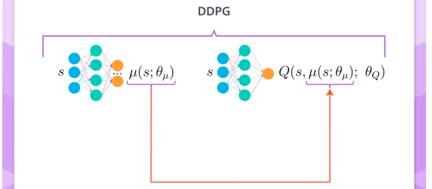
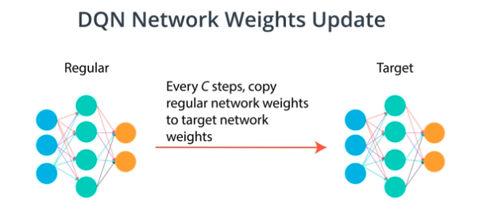

# Actor-Critic Methods

Actor-Critic methods try to use value based (VB) techniques to produce a baseline for policy based methods (PBM) which reduces the variance of the PBM. 

In ML we often encounter a trade-off between bias and variance. For example:

Estimating value function:

A great effort in research of RL is reducing the variance of an algorithm (which estimates the value function) while keeping its bias to a minimum.

## Two Ways For Estimating Expected Returns

MC method:

TD method (uses dynamic programing technique for assessing future reward) :

Why MC methods are higher variance and lower biased then TD methods:

Episode are compounded by many different actions (the episodes are the results of some randomness in a long sequence of actions). MC methods average over whole episodes and therefor have high variance, while on the other hand, the estimates of the value are based only on measurements and not on estimates (like in the TD methods), and therefor non-biased. TD methods average over only one action each time and therefore obtain a lower variance.

In act-crit methods we try to reduce the high variance of (commonly associated with) policy based agent by using a TD critic instead of a MC baseline. This further reduces the variance of PB methods. This also increases convergence rate as well as more consistent convergence than VB agents alone.

This method uses function approximation to learn a policy and a value function (2 neural nets).

## A Basic Actor-Critic Agent

**Reminder - ** Afvantage function:
$$
A(s,a)=Q(s,a)-V(s)
$$
<u>Summary:</u>

- The critic will learn to evaluate the state value function $V_\pi(s)$ using the TD estimate.
- Using the critic we will calculate the advantage function and train the actor using this value.

<u>Pseudo code:</u>

1. Input current state into the actor.
2. Actor yields an action to take in that state.
3. Observe $(r,s')$ (reward and next state) to obtain an experience tuple $(s,r,a,s')$.
4. Now we can obtain a new value function for this experience = $r+\gamma V(s',\theta_v)$ to train the critic.
5. Use the critic estimated value function to calculate the advantage function $A(s,a)=r+\gamma V(s',\theta_v)-V(s,\theta_v)$
6. Finally, train the actor using $A$ as the baseline.

One important thing to note here is that I use $V(s;\theta_v)$ or $A(s,a)$, but sometimes $V_\pi(s;\theta_v)$ or $A_\pi(s,a)$ (see the $\pi$ there? (see the $\theta_v$? What's going on?)

There are 2 thing actually going on in there.

1. A very common thing you'll see in reinforcement learning is the oversimplification of notation. However, both styles, whether you see $A(s,a)$, or $A_\pi(s,a)$ (value functions with or without a $\pi$) it means you are evaluating a value function of policy $\pi$. In the case of $A$, the advantage function. A different case would be when you see a superscript $*$. For example, $A^*(s,a)$ means the optimal advantage function. Q-learning learns the optimal action-value function, $Q^*(s,a)$, for example.
2. The other thing is the use of $\theta_v$ in some value functions and not in others. This only means that such value function is using a neural network. For example, $V(s;\theta_v)$ is using a neural network as a function approximator, but $A(s,a)$is not. We are calculating the advantage function A(s, a)*A*(*s*,*a*)using the state-value function $V(s;\theta_v)$, but $A(s, a)$ is not using function approximation directly.

# Some up to date actor-critic algorithim

#### A3C: Asynchronous Advantage Actor-Critic, N-step Bootstrapping

Instead of using a TD estimate it uses a **N-step bootstrapping** estimate which is an abstraction of MC and TD methods. TD is a 1-step bootstrap, since the agent experiences 1 time step of real reward and the "bootstraps". MC uses an entire episode without bootstrapping (infinite step bootstrap). Taking more steps before bootstrapping introduces less bias in prediction and trading-off with a bit higher variance. In practice 4 to 5 step bootstrapping often work the best. This algorithm propagates values to the last N states visited, which allows faster convergance with less experience required while still keeping variance under control.

Unlike DQN, A3S does not need a replay buffer. The replay buffer was used to decorrelate experience tuples. It uncouples the data collection process from the learning process. A3C uses parallel training to accomplish this. By creating multiple instances of the environment and agent. Different agents will likely experience different states at any given time. So learning is safe when useing each agents (correlated) experience minibatch, since minibatches are uncorrelated  between agents. This enables **on-policy** learning which is often associated with more stable learning.

On-policy: when the policy for interacting with the environment is also the policy being learned. SARSA - on-policy agent, Q-learning is off-policy, because the policy used to interact is an exploratory policy ($\epsilon$-greedy) while the policy that is being learned is the optimal policy.

Example:

In SARSA, the action used to calculate the TD-target ($R+\gamma Q(s',a') $) and the TD-Error (TD-target - $Q(s,a)$) is the action that the agent will take in the following time step.

In Q-learning, the action used in calculating the target is the action with the highest value (not guaranteed to be used by the agent for interaction with the environment in the following time step).

Off policy learning manages to explore more areas of the problem which has a dounside of sometimes being unstable and often causing divergence when using DNN. On policy throws away data that was collected with previous policies, which can be inefficient. 

AC3 is an on policy learning method. The asynchronous part is that each agent updated the global network at its own time, using the experience it has collected. 

Link to the Q-Prop paper: <https://arxiv.org/abs/1611.02247>

The paper above is about sample-efficient policy gradient with on off-policy critic.

Q-Prop is an option for implementation in the project ("fun")...

#### A2C: Advantage Actor-Critic

This algorithm has more code for synchronization of agents. It waits for the all agents to finish a segment of interaction and then updates the network at once. Then sends the updated weights to the agents for further interactions and repeats the process.

A2C is arguably simpler to implement, yet gives the +- same results (might be a little better). A3C is most easily trained on a CPU while A2C is more easy to extend to a GPU implementation.

##### A2C Code Walk-through:

In this [git repo](https://github.com/ShangtongZhang/DeepRL) are some very modular implementations of DRL algorithms.

In the examples.py file, there are many many implementations of DRL algs for many different problems.

[Link to code walk through a2c_cartpole](https://youtu.be/LiUBJje2N0c)

#### GAE: Generalized Advantage Estimation

GAE deals with the fact that for different problems the best N in N-step bootstrapping is different. Therefor the hyper-parameter $\lambda$ is introduced: 

The above, is the Lambda return for state s at time step t.

Note: when set to 0, then the LR is just the 1-step bootstrap TD estimate. When set to 1, then Infinite-step bootstrap, hence the MC estimate.

GAE is a way to train the critic with Lambda Return. This kind of return can be incorporated into any policy based method

[Link to the GAE paper](https://arxiv.org/abs/1506.02438)

#### DDPG: Deep Deterministic Policy Gradient, Continuous Action-space

DDPG could be seen as an approximate DQN rather than an actor-critic method. The "critic" in DDPG is used to approximate the maximizer over the Q values of the next state (rather than a learn baseline).

The problem with regular DQN is that its not straight forward to use in continuous action spaces. 

Note, the actor (left) learns to choose the optimal policy deterministically (outputs an action that maximizes the Q value, unlike PBM where the actor outputs a probability over the actions). The actor is basically learning $argmax_aQ(s,a)$. The critic learns to evaluate the optimal action-value function (by using the actors best believed action).

In the [DDPG paper](https://arxiv.org/abs/1509.02971), they introduced this algorithm as an "Actor-Critic" method. Though, some researchers think DDPG is best classified as a DQN method for continuous action spaces (along with [NAF](https://arxiv.org/abs/1603.00748)). Regardless, DDPG is a very successful method and it's good for you to gain some intuition.

#### DDPG: Deep Deterministic Policy Gradient, Soft Updates

Two interesting aspects of DDPG is the use of a relay buffer and the second is the soft updates to the target network.

<u>Big update of DQN:</u>

In the atari paper, C was set to 10,000 steps.

<u>Soft update of DDPG:</u>

This technique was also used in the Navigation project using DQN.

##### Code Walkthrough

[link to video](https://youtu.be/08V9r3NgFSE)

