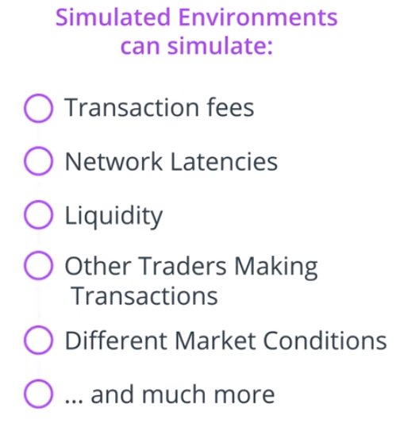

### Challenges of Supervised Learning

Even if a supervised learning algorithm can predict the price it might fail to cope with latency:

Transaction fees change and pose uncertainties that need to be taken into account.

Even if the above is taken care of, we still need a trading strategy (when to buy, hold or transfer).

Learning a strategy for different market conditions would also need to be taken into account in order to train a supervised learning algorithm.

Consequently, training a supervised learning algorithm is very difficult since we also do not know to what strategy to train for.

## Advantages of RL for Trading 

Optional training strategies:

* Net profit
* Risk-adjusted return

Since DRL are trained on simulated environments, we can create an environment that captures all the complexity of the financial market:

