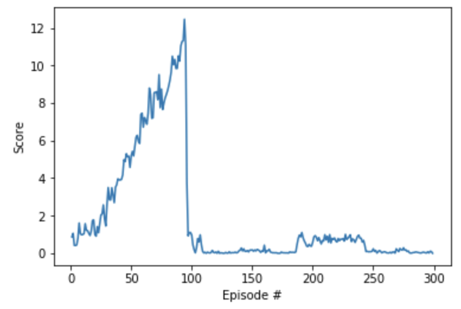

# Benchmark Implementation


For this project, you can use any algorithm of your choosing to solve the task. You are strongly encouraged to do your own research, to devise your own approach towards solving this problem.

In case you get stuck, here are the details of one approach that worked well for us.

## An Amended DDPG Agent

------

In this part of the Nanodegree program, you learned about a lot of potential ways to solve this project. We instead decided to solve the project by making some amendments to the Deep Deterministic Policy Gradients (DDPG) algorithm.

### Attempt 1

The first thing that we did was amend the DDPG code to work for multiple agents, to solve version 2 of the environment. The DDPG code in the DRLND GitHub repository utilizes only a single agent, and with each step:

- the agent adds its experience to the replay buffer, and
- the (local) actor and critic networks are updated, using a sample from the replay buffer.

So, in order to make the code work with 20 agents, we modified the code so that after each step:

- each agent adds its experience to a replay buffer that is shared by all agents, and
- the (local) actor and critic networks are updated 20 times in a row (one for each agent), using 20 different samples from the replay buffer.

In hindsight, this wasn't a great plan, but it was a start! That said, the scores are shown below.





You'll notice that we made some rapid improvement pretty early in training, because of the extremely large number of updates. Unfortunately, also due to the large number of updates, the agent is incredibly unstable. Around episode 100, performance crashed and did not recover.

So, we focused on determining ways to stabilize this first attempt.

### Attempt 2

For this second attempt, we reduced the number of agents from 20 to 1 (by switching to version 1 of the environment). We wanted to know how much stability we could expect from a single agent. The idea was that the code would likely train more reliably, if we didn't make so many updates. And it did train much better.


At one point, we even hit the target score of 30. However, this score wasn't maintained for very long, and we saw strong indications that the algorithm was going to crash again. This showed us that we needed to spend more time with figuring out how to stabilize the algorithm, if we wanted to have a chance of training all 20 agents simultaneously.

### Attempt 3

This time, we switched back to version 2 of the environment, and began with the code from **Attempt 1**as a starting point. Then, the only change we made was to use gradient clipping when training the critic network. The corresponding snippet of code was as follows:

```python
self.critic_optimizer.zero_grad()
critic_loss.backward()
torch.nn.utils.clip_grad_norm(self.critic_local.parameters(), 1)
self.critic_optimizer.step()
```

The corresponding scores are plotted below.


This is when we really started to feel hopeful. We still didn't maintain an average score of 30 over 100 episodes, but we maintained the score for longer than before. And the agent didn't crash as suddenly as in the previous attempts!

### Attempt 4

At this point, we decided to get less aggressive with the number of updates per time step. In particular, instead of updating the actor and critic networks **20 times** at **every timestep**, we amended the code to update the networks **10 times** after every **20 timesteps**. The corresponding scores are plotted below.


And, this was enough to solve the environment! In hindsight, we probably should have realized this fix much earlier, but this long path to the solution was definitely a nice way to help with building intuition! :)


## Note

------

If you are interested in implementing a method that will be more stable with the project, please explore [this paper](https://arxiv.org/abs/1604.06778). As discussed in the paper, Trust Region Policy Optimization (TRPO) and Truncated Natural Policy Gradient (TNPG) should achieve better performance. You may also like to write your own implementation of Proximal Policy Optimization (PPO), which has also [demonstrated good performance](https://blog.openai.com/openai-baselines-ppo/) with continuous control tasks.

You may also like to explore the (very!) recent [Distributed Distributional Deterministic Policy Gradients (D4PG)](https://openreview.net/forum?id=SyZipzbCb) algorithm as another method for adapting DDPG for continuous control.


# Not sure where to start?


If you're not sure where to start, here are some suggestions for how to make some progress with the project. You need not follow this advice; these are only suggestions, and you should follow whatever path works best for you!

## Step 1: Master the details of the Deep Deterministic Policy Gradients (DDPG) algorithm.

------

Read the [DDPG paper](https://arxiv.org/abs/1509.02971) to master all of the details. Focus on the information in **3. Algorithm** and **7. Experiment Details** to learn how to adapt the implementation for your task. Refer to the lesson on **Actor-Critic Methods** to cement your understanding. If you have any questions, post them in Slack!

## Step 2: Study the coding exercise from the lesson.

------

In the **Actor-Critic Methods** lesson, you applied a DDPG implementation to an OpenAI Gym task. Take the time to understand this code in great detail. Tweak the various hyperparameters and settings to build your intuition for what should work well (*and what doesn't!*).

## Step 3: Adapt the code from the lesson to the project.

------

Adapt the code from the exercise to the project, while making as few modifications as possible. Don't worry about efficiency, and just make sure the code runs. Don't worry about modifying hyperparameters, optimizers, or anything else of that nature just yet.

For this step, you do not need to run your code on a GPU. **In particular, if working in the Udacity-provided Workspace, GPU should not be enabled.** Save your GPU hours for the next step!

## Step 4: Optimize the hyperparameters.

------

After you have verified that your DDPG code runs, try a few long training sessions while running your code on CPU. If your agent fails to learn, try out a few potential solutions by modifying your code. Once you're feeling confident (*or impatient :)*) try out your implementation with GPU support!

## Step 5: Continue to explore!

------

Read [this paper](https://arxiv.org/abs/1604.06778), which evaluates the performance of various deep RL algorithms on continuous control tasks. The paper introduces REINFORCE, TNPG, RWR, REPS, TRPO, CEM, CMA-ES and DDPG, and provides some useful suggestions that will help you to figure out which are best suited for the project.


# (Optional) Challenge: Crawl


After you have successfully completed the project, you might like to solve a more difficult continuous control environment, where the goal is to teach a creature with four legs to walk forward without falling.

You can read more about this environment in the ML-Agents GitHub [here](https://github.com/Unity-Technologies/ml-agents/blob/master/docs/Learning-Environment-Examples.md#crawler).


## Download the Unity Environment

------

To solve this harder task, you'll need to download a new Unity environment. You need only select the environment that matches your operating system:

- Linux: [click here](https://s3-us-west-1.amazonaws.com/udacity-drlnd/P2/Crawler/Crawler_Linux.zip)
- Mac OSX: [click here](https://s3-us-west-1.amazonaws.com/udacity-drlnd/P2/Crawler/Crawler.app.zip)
- Windows (32-bit): [click here](https://s3-us-west-1.amazonaws.com/udacity-drlnd/P2/Crawler/Crawler_Windows_x86.zip)
- Windows (64-bit): [click here](https://s3-us-west-1.amazonaws.com/udacity-drlnd/P2/Crawler/Crawler_Windows_x86_64.zip)

Then, place the file in the `p2_continuous-control/` folder in the DRLND GitHub repository, and unzip (or decompress) the file.

> Please do not submit a project with this new environment. You are **required** to complete the project with the Reacher environment that was provided earlier in this lesson, in **The Environment - Explore**.

(*For AWS*) If you'd like to train the agent on AWS (and have not [enabled a virtual screen](https://github.com/Unity-Technologies/ml-agents/blob/master/docs/Training-on-Amazon-Web-Service.md)), then please use [this link](https://s3-us-west-1.amazonaws.com/udacity-drlnd/P2/Crawler/Crawler_Linux_NoVis.zip) to obtain the "headless" version of the environment. You will **not** be able to watch the agent without enabling a virtual screen, but you will be able to train the agent. (*To watch the agent, you should follow the instructions to enable a virtual screen, and then download the environment for the **Linux** operating system above.*)

## Explore the Environment

------

After you have followed the instructions above, open `Crawler.ipynb` (located in the `p2_continuous-control/` folder in the DRLND GitHub repository) and follow the instructions to learn how to use the Python API to control the agent.