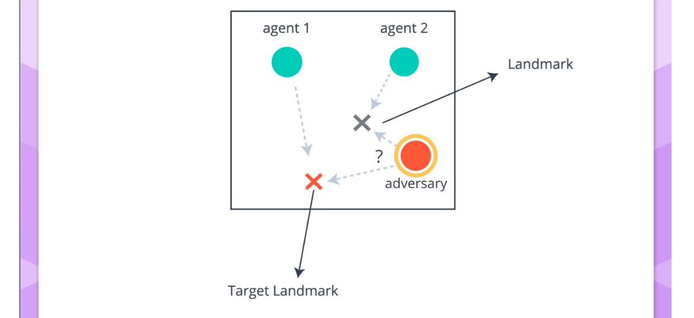

# Multi-Agent RL

Markov Games framework - 

Using single agent algorithms in multi-agent environments usually leads to non-stationarity problems or very big joint action space. 

**<u>Reminder:</u>**

 DDPG is an off-policy actor-critic algorithm that uses the concepts of target networks.

Multi-agent particle is an OpenAI environment that consists of particles (agents) and some landmarks. This environment is used to test many interesting experimental scenarios. One of which is 'physical deception':

In this environment agents cooperate to reach a target landmark. The the agents are rewarded for minimal distance (closer is better) from any agent (in blue) to the target landmark and penalized with the distance of the adversary distance to the target landmark (closer is worse). The adversary cannot tell the difference between real landmarks and non-real ones. Under this reward structure agents cooperate to spread out across all the landmarks as so to deceive the adversary.

The framework of centralized learning and decentralized execution has been adopted in the following paper  [“Multi Agent Actor Critic for Mixed Cooperative Competitive environments“](https://papers.nips.cc/paper/7217-multi-agent-actor-critic-for-mixed-cooperative-competitive-environments.pdf) (by OpenAI).

This framework can be naturally implemented using an Actor-Critic algorithm:

During training, the critic, for each agent, uses additional information (states observed and actions taken by all other agents). And an actor is used (1 for each agent) which has access to **only ** its own observations and actions. During execution time, only the actors are present. Learning critic for each agent allows us to use a different reward structure for each agent.  This is why the algorithm can be used in all competitive, cooperative and mixed scenarios.   

