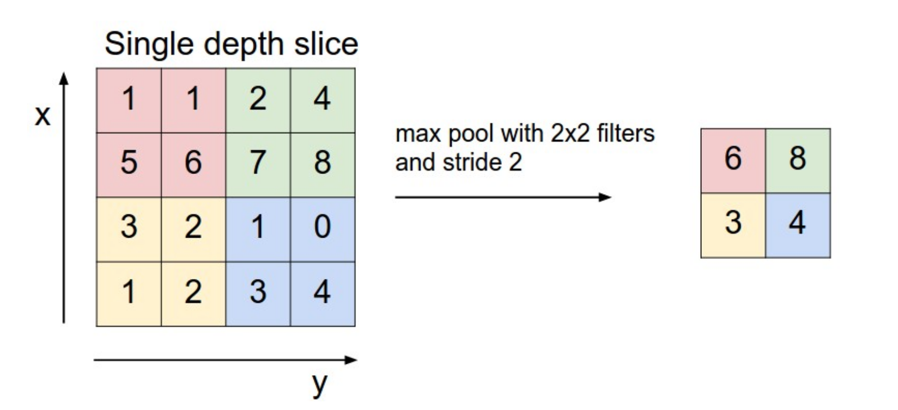
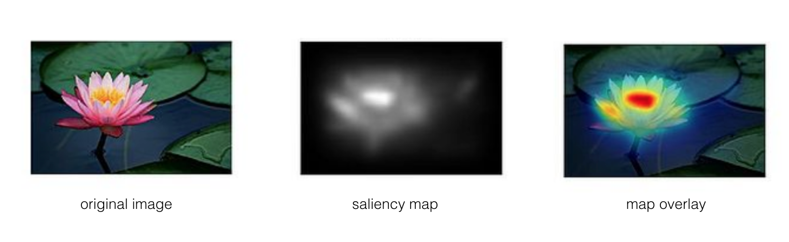

## Convolutional Neural Networks (CNN's)

The type of deep neural network that is most powerful in image processing tasks, such as sorting images into groups, is called a Convolutional Neural Network (CNN). CNN's consist of layers that process visual information. A CNN first takes in an input image and then passes it through these layers. There are a few different types of layers, and we'll start by learning about the most commonly used layers: convolutional, pooling, and fully-connected layers.

First, let's take a look at a complete CNN architecture; below is a network called VGG-16, which has been trained to recognize a variety of image classes. It takes in an image as input, and outputs a predicted class for that image. The various layers are labeled and we'll go over each type of layer in this network in the next series of videos.

**VGG-16:**


## Convolutional Layer

The first layer in this network, that processes the input image directly, is a convolutional layer.

- A convolutional layer takes in an image as input.
- A convolutional layer, as its name suggests, is made of a set of convolutional filters.
- Each filter extracts a specific kind of feature, ex. a high-pass filter is often used to detect the edge of an object.
- The output of a given convolutional layer is a set of **feature maps** (also called activation maps), which are filtered versions of an original input image.


### Activation Function

You may also note that the diagram reads "convolution + ReLu," and the **ReLu** stands for Rectified Linear Unit (ReLU) activation function. This activation function is zero when the input x <= 0 and then linear with a slope = 1 when x > 0. ReLu's, and other activation functions, are typically placed after a convolutional layer to slightly transform the output so that it's more efficient to perform backpropagation and effectively train the network.

method:


Note: the filter is as deep as the input layer. Its common to use 10-100's of these filters in a single layer of the cnn.  Each filter corresponds to a specific pattern. A conv layer which is applied on a conv layer is said to look for patterns of patterns (and so on).


# Defining Layers in PyTorch

### Define a Network Architecture

The various layers that make up any neural network are documented, [here](https://pytorch.org/docs/stable/nn.html). For a convolutional neural network, we'll use a simple series of layers:

- Convolutional layers
- Maxpooling layers
- Fully-connected (linear) layers

------

To define a neural network in PyTorch, you'll create and name a new neural network class, define the layers of the network in a function `__init__` and define the feedforward behavior of the network that employs those initialized layers in the function `forward`, which takes in an input image tensor, `x`. The structure of such a class, called `Net` is shown below.

Note: During training, PyTorch will be able to perform backpropagation by keeping track of the network's feedforward behavior and using autograd to calculate the update to the weights in the network.


```python
import torch.nn as nn
import torch.nn.functional as F

class Net(nn.Module):

    def __init__(self, n_classes):
        super(Net, self).__init__()

        # 1 input image channel (grayscale), 32 output channels/feature maps
        # 5x5 square convolution kernel
        self.conv1 = nn.Conv2d(1, 32, 5)

        # maxpool layer
        # pool with kernel_size=2, stride=2
        self.pool = nn.MaxPool2d(2, 2)

        # fully-connected layer
        # 32*4 input size to account for the downsampled image size after pooling
        # num_classes outputs (for n_classes of image data)
        self.fc1 = nn.Linear(32*4, n_classes)

    # define the feedforward behavior
    def forward(self, x):
        # one conv/relu + pool layers
        x = self.pool(F.relu(self.conv1(x)))

        # prep for linear layer by flattening the feature maps into feature vectors
        x = x.view(x.size(0), -1)
        # linear layer 
        x = F.relu(self.fc1(x))

        # final output
        return x

# instantiate and print your Net
n_classes = 20 # example number of classes
net = Net(n_classes)
print(net)
```


Let's go over the details of what is happening in this code.

#### Define the Layers in `__init__`

Convolutional and maxpooling layers are defined in `__init__`:

```
# 1 input image channel (for grayscale images), 32 output channels/feature maps, 3x3 square convolution kernel
self.conv1 = nn.Conv2d(1, 32, 3)

# maxpool that uses a square window of kernel_size=2, stride=2
self.pool = nn.MaxPool2d(2, 2)      
```

#### Refer to Layers in `forward`

Then these layers are referred to in the `forward` function like this, in which the conv1 layer has a ReLu activation applied to it before maxpooling is applied:

```
x = self.pool(F.relu(self.conv1(x)))
```

Best practice is to place any layers whose weights will change during the training process in `__init__`and refer to them in the `forward` function; any layers or functions that always behave in the same way, such as a pre-defined activation function, may appear in the `__init__` or in the `forward`function; it is mostly a matter of style and readability.


## Pooling


### Pooling Layer

After a couple of convolutional layers (+ReLu's), in the VGG-16 network, you'll see a maxpooling layer.

- Pooling layers take in an image (usually a filtered image) and output a reduced version of that image
- Pooling layers reduce the dimensionality of an input
- **Maxpooling** layers look at areas in an input image (like the 4x4 pixel area pictured below) and choose to keep the maximum pixel value in that area, in a new, reduced-size area.
- Maxpooling is the most common type of pooling layer in CNN's, but there are also other types such as average pooling.



Global Average Pooling is reducing the whole 4x4 to 1x1:


# Visualizing training results:

**Final Feature Vector**

So, how can we understand what’s going on in this final feature vector? What kind of information has it distilled from an image?

To visualize what a vector represents about an image, we can compare it to other feature vectors, produced by the same CNN as it sees different input images. We can run a bunch of different images through a CNN and record the last feature vector for each image. This creates a feature space, where we can compare how similar these vectors are to one another.

### Dimensionality reduction

Another method for visualizing this last layer in a CNN is to reduce the dimensionality of the final feature vector so that we can display it in 2D or 3D space.

For example, say we have a CNN that produces a 256-dimension vector (a list of 256 values). In this case, our task would be to reduce this 256-dimension vector into 2 dimensions that can then be plotted on an x-y axis. There are a few techniques that have been developed for compressing data like this.

**Principal Component Analysis**

One is PCA, principal component analysis, which takes a high dimensional vector and compresses it down to two dimensions. It does this by looking at the feature space and creating two variables (x, y) that are functions of these features; these two variables want to be as different as possible, which means that the produced x and y end up separating the original feature data distribution by as large a margin as possible.

**t-SNE**

Another really powerful method for visualization is called t-SNE (pronounced, tea-SNEE), which stands for t-distributed stochastic neighbor embeddings. It’s a non-linear dimensionality reduction that, again, aims to separate data in a way that clusters similar data close together and separates differing data.

As an example, below is a t-SNE reduction done on the MNIST dataset, which is a dataset of thousands of 28x28 images, similar to FashionMNIST, where each image is one of 10 hand-written digits 0-9.

The 28x28 pixel space of each digit is compressed to 2 dimensions by t-SNE and you can see that this produces ten clusters, one for each type of digits in the dataset!


### t-SNE and practice with neural networks

If you are interested in learning more about neural networks, take a look at the **Elective Section: Text Sentiment Analysis**. Though this section is about text classification and not images or visual data, the instructor, Andrew Trask, goes through the creation of a neural network step-by-step, including setting training parameters and changing his model when he sees unexpected loss results.

He also provides an example of t-SNE visualization for the sentiment of different words, so you can actually see whether certain words are typically negative or positive, which is really interesting!

**This elective section will be especially good practice for the upcoming section Advanced Computer Vision and Deep Learning**, which covers RNN's for analyzing sequences of data (like sequences of text). So, if you don't want to visit this section now, you're encouraged to look at it later on.

## Other Feature Visualization Techniques

Feature visualization is an active area of research and before we move on, I'd like like to give you an overview of some of the techniques that you might see in research or try to implement on your own!


### Occlusion Experiments

Occlusion means to block out or mask part of an image or object. For example, if you are looking at a person but their face is behind a book; this person's face is hidden (occluded). Occlusion can be used in feature visualization by blocking out selective parts of an image and seeing how a network responds.

The process for an occlusion experiment is as follows:

1. Mask part of an image before feeding it into a trained CNN,
2. Draw a heatmap of class scores for each masked image,
3. Slide the masked area to a different spot and repeat steps 1 and 2.

The result should be a heatmap that shows the predicted class of an image as a function of which part of an image was occluded. The reasoning is that **if the class score for a partially occluded image is different than the true class, then the occluded area was likely very important**!


Occlusion experiment with an image of an elephant.


### Saliency Maps

Salience can be thought of as the importance of something, and for a given image, a saliency map asks: Which pixels are most important in classifying this image?

Not all pixels in an image are needed or relevant for classification. In the image of the elephant above, you don't need all the information in the image about the background and you may not even need all the detail about an elephant's skin texture; only the pixels that distinguish the elephant from any other animal are important.

Saliency maps aim to show these important pictures by computing the gradient of the class score with respect to the image pixels. A gradient is a measure of change, and so, the gradient of the class score with respect to the image pixels is a measure of how much a class score for an image changes if a pixel changes a little bit.

**Measuring change**

A saliency map tells us, for each pixel in an input image, if we change it's value slightly (by *dp*), how the class output will change. If the class scores change a lot, then the pixel that experienced a change, dp, is important in the classification task.

Looking at the saliency map below, you can see that it identifies the most important pixels in classifying an image of a flower. These kinds of maps have even been used to perform image segmentation (imagine the map overlay acting as an image mask)!




Graph-based saliency map for a flower; the most salient (important) pixels have been identified as the flower-center and petals.


### Guided Backpropagation

Similar to the process for constructing a saliency map, you can compute the gradients for mid level neurons in a network with respect to the input pixels. Guided backpropagation looks at each pixel in an input image, and asks: if we change it's pixel value slightly, how will the output of a particular neuron or layer in the network change. If the expected output change a lot, then the pixel that experienced a change, is important to that particular layer.

This is very similar to the backpropagation steps for measuring the error between an input and output and propagating it back through a network. Guided backpropagation tells us exactly which parts of the image patches, that we’ve looked at, activate a specific neuron/layer.


[Examples of guided backpropagation, from ](https://classroom.udacity.com/nanodegrees/nd893/parts/26e3031e-6c15-456a-8811-eeeac0a3e196/modules/f1ea67a5-4d33-4f14-b84c-ddbc8ef86d23/lessons/a747f249-4124-4a7e-9e74-ee50e607c849/concepts/f92c1def-db47-41f5-8dcc-cc11e0964f86#)[this paper](https://arxiv.org/pdf/1412.6806.pdf).


#### Supporting Materials

[ Visualizing Conv Nets](https://s3.amazonaws.com/video.udacity-data.com/topher/2018/April/5adf876c_visualizing-conv-nets/visualizing-conv-nets.pdf)

[ Guided Backprop Network Simplicity](https://s3.amazonaws.com/video.udacity-data.com/topher/2018/April/5adf8cd9_guided-backprop-network-simplicity/guided-backprop-network-simplicity.pdf)