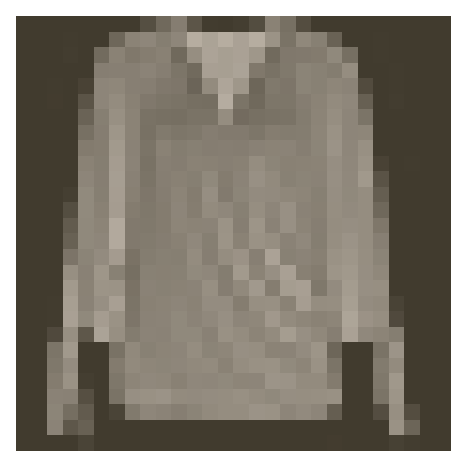

# Lesson Overview

Welcome! In this lesson, you'll learn how to use PyTorch for building deep learning models. PyTorch was released in early 2017 and has been making a pretty big impact in the deep learning community. It's developed as an open source project by the [Facebook AI Research team](https://research.fb.com/category/facebook-ai-research-fair/), but is being adopted by teams everywhere in industry and academia. In my experience, it's the best framework for learning deep learning and just a delight to work with in general. By the end of this lesson, you'll have trained your own deep learning model that can classify images of cats and dogs.

I'll first give you a basic introduction to PyTorch, where we'll cover **tensors** - the main data structure of PyTorch. I'll show you how to create tensors, how to do simple operations, and how tensors interact with NumPy.

Then you'll learn about a module called **autograd** that PyTorch uses to calculate gradients for training neural networks. Autograd, in my opinion, is amazing. It does all the work of backpropagation for you by calculating the gradients at each operation in the network which you can then use to update the network weights.

Next you'll use PyTorch to build a network and run data forward through it. After that, you'll define a loss and an optimization method to train the neural network on a dataset of handwritten digits. You'll also learn how to test that your network is able to generalize through **validation**.

However, you'll find that your network doesn't work too well with more complex images. You'll learn how to use pre-trained networks to improve the performance of your classifier, a technique known as **transfer learning**.

If you'd like to work through the notebooks on your own machine or otherwise outside the classroom, you can find the code in [this repo](https://github.com/udacity/DL_PyTorch).

See you in the lesson!


## Tensors

It turns out neural network computations are just a bunch of linear algebra operations on *tensors*, a generalization of matrices. A vector is a 1-dimensional tensor, a matrix is a 2-dimensional tensor, an array with three indices is a 3-dimensional tensor (RGB color images for example). The fundamental data structure for neural networks are tensors and PyTorch (as well as pretty much every other deep learning framework) is built around tensors.


**Basics:**

With the basics covered, it's time to explore how we can use PyTorch to build a simple neural network.


```
%matplotlib inline
%config InlineBackend.figure_format = 'retina'

import numpy as np
import torch

import helper
```

First, let's see how we work with PyTorch tensors. These are the fundamental data structures of neural networks and PyTorch, so it's imporatant to understand how these work.


```
x = torch.rand(3, 2)
x
```

Out[4]:

```
 0.9107  0.7433
 0.7535  0.6031
 0.7666  0.8878
[torch.FloatTensor of size 3x2]
```

```
y = torch.ones(x.size())
y
```

Out[5]:

```
 1  1
 1  1
 1  1
[torch.FloatTensor of size 3x2]
```

```
z = x + y
z
```

Out[6]:

```
 1.9107  1.7433
 1.7535  1.6031
 1.7666  1.8878
[torch.FloatTensor of size 3x2]
```

In general PyTorch tensors behave similar to Numpy arrays. They are zero indexed and support slicing.


```
z[0]
```

Out[7]:

```
 1.9107
 1.7433
[torch.FloatTensor of size 2]
```

```
z[:, 1:]
```
Out[8]:

```
 1.7433
 1.6031
 1.8878
[torch.FloatTensor of size 3x1]
```


Tensors typically have two forms of methods, one method that returns another tensor and another method that performs the operation in place. That is, the values in memory for that tensor are changed without creating a new tensor. In-place functions are always followed by an underscore, for example `z.add()` and `z.add_()`.

```
# Return a new tensor z + 1
z.add(1)
```


Out[9]:

```
 2.9107  2.7433
 2.7535  2.6031
 2.7666  2.8878
[torch.FloatTensor of size 3x2]
```


```
# z tensor is unchanged
z
```

Out[10]:

```
 1.9107  1.7433
 1.7535  1.6031
 1.7666  1.8878
[torch.FloatTensor of size 3x2]
```

```

# Add 1 and update z tensor in-place
z.add_(1)
```


Out[11]:

```
 2.9107  2.7433
 2.7535  2.6031
 2.7666  2.8878
[torch.FloatTensor of size 3x2]
```


### Reshaping

Reshaping tensors is a really common operation. First to get the size and shape of a tensor use `.size()`. Then, to reshape a tensor, use `.resize_()`. Notice the underscore, reshaping is an in-place operation.

```
z.size()
```
Out[13]:
```
torch.Size([3, 2])
```

In [14]:


```
z.resize_(2, 3)
```

Out[14]:

```
 2.9107  2.7433  2.7535
 2.6031  2.7666  2.8878
[torch.FloatTensor of size 2x3]
```

## Numpy to Torch and back

Converting between Numpy arrays and Torch tensors is super simple and useful. To create a tensor from a Numpy array, use `torch.from_numpy()`. To convert a tensor to a Numpy array, use the `.numpy()` method.


```
b = torch.from_numpy(a)
b

Out[15]:
 0.3367  0.5953  0.6543
 0.8653  0.5995  0.2804
 0.4841  0.9836  0.3388
 0.2559  0.5108  0.3999
[torch.DoubleTensor of size 4x3]

```


The memory is shared between the Numpy array and Torch tensor, so if you change the values in-place of one object, the other will change as well.


## Defining Networks

### One of the options shown:

```python
import numpy as np
import torch
import helper
import matplotlib.pyplot as plt
from torchvision import datasets, transforms

# The following transform does: 1. convert image to tensor, 2. subtract 0.5 from each channel, 3. devides 0.5 from each channel. This Changes the range og these images from 0:+1 to -1:+1.
transform = transforms.Compose([transforms.ToTensor(),
                              transforms.Normalize((0.5, 0.5, 0.5), (0.5, 0.5, 0.5)),
                             ])
# Download and load the training data
trainset = datasets.MNIST('MNIST_data/', download=True, train=True, transform=transform)
trainloader = torch.utils.data.DataLoader(trainset, batch_size=64, shuffle=True)

# Download and load the test data
testset = datasets.MNIST('MNIST_data/', download=True, train=False, transform=transform)
testloader = torch.utils.data.DataLoader(testset, batch_size=64, shuffle=True)

dataiter = iter(trainloader)
images, labels = dataiter.next()

# Hyperparameters for our network
input_size = 784
hidden_sizes = [128, 64]
output_size = 10

# build network:
from collections import OrderedDict
model = nn.Sequential(OrderedDict([
                      ('fc1', nn.Linear(input_size, hidden_sizes[0])),
                      ('relu1', nn.ReLU()),
                      ('fc2', nn.Linear(hidden_sizes[0], hidden_sizes[1])),
                      ('relu2', nn.ReLU()),
                      ('output', nn.Linear(hidden_sizes[1], output_size)),
                      ('softmax', nn.Softmax(dim=1))]))
print(model)

# Forward pass through the network and display output
images, labels = next(iter(trainloader))
images.resize_(images.shape[0], 1, 784)
ps = model.forward(images[0,:])
helper.view_classify(images[0].view(1, 28, 28), ps)


```

### Another option:


```python
from torch import nn
from torch import optim
import torch.nn.functional as F

class Network(nn.Module):
    def __init__(self):
        super().__init__()
        # Defining the layers, 128, 64, 10 units each
        self.fc1 = nn.Linear(784, 128)
        self.fc2 = nn.Linear(128, 64)
        # Output layer, 10 units - one for each digit
        self.fc3 = nn.Linear(64, 10)
        
    def forward(self, x):
        ''' Forward pass through the network, returns the output logits '''
        
        x = self.fc1(x)
        x = F.relu(x)
        x = self.fc2(x)
        x = F.relu(x)
        x = self.fc3(x)
        x = F.softmax(x, dim=1)
        
        return x

model = Network()


#Set biases to all zeros
model.fc1.bias.data.fill_(0)


# sample from random normal with standard dev = 0.01
model.fc1.weight.data.normal_(std=0.01)


# Grab some data 
dataiter = iter(trainloader)
images, labels = dataiter.next()

# Resize images into a 1D vector, new shape is (batch size, color channels, image pixels) 
images.resize_(64, 1, 784)
# or images.resize_(images.shape[0], 1, 784) to not automatically get batch size

# Forward pass through the network
img_idx = 0
ps = model.forward(images[img_idx,:])

img = images[img_idx]
helper.view_classify(img.view(1, 28, 28), ps)
​```
```

# Training:

The first thing we need to do for training is define our loss function. In PyTorch, you'll usually see this as `criterion`. Here we're using softmax output, so we want to use `criterion = nn.CrossEntropyLoss()` as our loss. Later when training, you use `loss = criterion(output, targets)` to calculate the actual loss.

We also need to define the optimizer we're using, SGD (stochastic GD) or Adam, or something along those lines. Here I'll just use SGD with `torch.optim.SGD`, passing in the network parameters and the learning rate.

## Autograd

Torch provides a module, `autograd`, for automatically calculating the gradient of tensors. It does this by keeping track of operations performed on tensors. To make sure PyTorch keeps track of operations on a tensor and calculates the gradients, you need to set `requires_grad` on a tensor. You can do this at creation with the `requires_grad`keyword, or at any time with `x.requires_grad_(True)`.

You can turn off gradients for a block of code with the `torch.no_grad()` content:

```python
x = torch.zeros(1, requires_grad=True)
>>> with torch.no_grad():
...     y = x * 2
>>> y.requires_grad
False
```

Also, you can turn on or off gradients altogether with `torch.set_grad_enabled(True|False)`.

The gradients are computed with respect to some variable `z` with `z.backward()`. This does a backward pass through the operations that created `z`.


```python
%matplotlib inline
%config InlineBackend.figure_format = 'retina'

from collections import OrderedDict

import numpy as np
import time

import torch
from torch import nn
from torch import optim
import torch.nn.functional as F

import helper

x = torch.randn(2,2, requires_grad=True)
print(x)

y = x**2
print(y)

## grad_fn shows the function that generated this variable
print(y.grad_fn)
​```
```

The autgrad module keeps track of these operations and knows how to calculate the gradient for each one. In this way, it's able to calculate the gradients for a chain of operations, with respect to any one tensor. Let's reduce the tensor `y` to a scalar value, the mean.

```python
z = y.mean()
print(z)
print(x.grad)
```

To calculate the gradients, you need to run the `.backward` method on a Variable, `z` for example. This will calculate the gradient for `z` with respect to `x`
$$
\frac{\partial z}{\partial x} = \frac{\partial}{\partial x}\left[\frac{1}{n}\sum_i^n x_i^2\right] = \frac{x}{2}
$$

```python
z.backward()
print(x.grad)
print(x/2)

Output:
tensor([[-0.4834, -0.4678],
        [-0.2473,  0.4049]])
tensor([[-0.4834, -0.4678],
        [-0.2473,  0.4049]])
```

These gradients calculations are particularly useful for neural networks. For training we need the gradients of the weights with respect to the cost. With PyTorch, we run data forward through the network to calculate the cost, then, go backwards to calculate the gradients with respect to the cost. Once we have the gradients we can make a gradient descent step.

## Get the data and define the network

The same as we saw in part 3, we'll load the MNIST dataset and define our network.

```python
from torchvision import datasets, transforms

# Define a transform to normalize the data
transform = transforms.Compose([transforms.ToTensor(),
                              transforms.Normalize((0.5, 0.5, 0.5), (0.5, 0.5, 0.5)),
                             ])
# Download and load the training data
trainset = datasets.MNIST('MNIST_data/', download=True, train=True, transform=transform)
trainloader = torch.utils.data.DataLoader(trainset, batch_size=64, shuffle=True)
```

I'll build a network with `nn.Sequential` here. Only difference from the last part is I'm not actually using softmax on the output, but instead just using the raw output from the last layer. This is because the output from softmax is a probability distribution. Often, the output will have values really close to zero or really close to one. Due to [inaccuracies with representing numbers as floating points](https://docs.python.org/3/tutorial/floatingpoint.html), computations with a softmax output can lose accuracy and become unstable. To get around this, we'll use the raw output, called the **logits**, to calculate the loss.

```python
# Hyperparameters for our network
input_size = 784
hidden_sizes = [128, 64]
output_size = 10

# Build a feed-forward network
model = nn.Sequential(OrderedDict([
                      ('fc1', nn.Linear(input_size, hidden_sizes[0])),
                      ('relu1', nn.ReLU()),
                      ('fc2', nn.Linear(hidden_sizes[0], hidden_sizes[1])),
                      ('relu2', nn.ReLU()),
                      ('logits', nn.Linear(hidden_sizes[1], output_size))]))
```

## Training the network!

The first thing we need to do for training is define our loss function. In PyTorch, you'll usually see this as `criterion`. Here we're using softmax output, so we want to use `criterion = nn.CrossEntropyLoss()` as our loss. Later when training, you use `loss = criterion(output, targets)` to calculate the actual loss.

We also need to define the optimizer we're using, SGD or Adam, or something along those lines. Here I'll just use SGD with `torch.optim.SGD`, passing in the network parameters and the learning rate.

```python
criterion = nn.CrossEntropyLoss()
optimizer = optim.SGD(model.parameters(), lr=0.01)
```

First, let's consider just one learning step before looping through all the data. The general process with PyTorch:

* Make a forward pass through the network to get the logits 
* Use the logits to calculate the loss
* Perform a backward pass through the network with `loss.backward()` to calculate the gradients
* Take a step with the optimizer to update the weights

Below I'll go through one training step and print out the weights and gradients so you can see how it changes.

```python
print('Initial weights - ', model.fc1.weight)

images, labels = next(iter(trainloader))
images.resize_(64, 784)

# Clear the gradients, do this because gradients are accumulated
optimizer.zero_grad()
# NOTE: Not calling zero_grad causes gradient accumulation of every backword pass!


# Forward pass, then backward pass, then update weights
output = model.forward(images)
loss = criterion(output, labels)
loss.backward()
print('Gradient -', model.fc1.weight.grad)
optimizer.step()
```

Output: 

```matlab
Initial weights -  Parameter containing:
tensor([[ 1.3359e-02, -1.6000e-02, -2.8418e-02,  ...,  8.6657e-03,
          1.2813e-02,  1.1434e-02],
        [-5.7364e-03,  2.4943e-03,  2.6801e-02,  ..., -3.8133e-03,
          1.3287e-02, -8.3737e-03],
        [ 5.8358e-03, -2.0346e-02,  2.3486e-02,  ...,  2.1825e-02,
         -4.4507e-03,  3.1794e-02],
        ...,
        [-6.3821e-03,  2.4910e-02, -1.6916e-02,  ..., -1.7003e-02,
         -2.5421e-02, -1.1408e-02],
        [-4.1603e-03, -2.4534e-02,  3.5697e-02,  ..., -2.4115e-02,
          2.3288e-02,  1.5213e-02],
        [-7.2174e-03,  8.5885e-03, -7.6700e-03,  ..., -2.8960e-02,
         -1.4874e-02,  2.6881e-03]])
```

```python
print('Updated weights - ', model.fc1.weight)
```
Output:
```matlab
Updated weights -  Parameter containing:
tensor([[-2.1167e-02,  6.2758e-03,  1.9314e-02,  ...,  2.1187e-02,
          3.0000e-02, -3.2556e-02],
        [-1.0437e-02,  1.9246e-02,  1.9345e-02,  ...,  2.1103e-03,
          8.4939e-03,  6.5590e-04],
        [-1.7335e-02, -1.6198e-02, -3.0482e-03,  ..., -3.0893e-02,
         -2.5708e-02,  1.0861e-02],
        ...,
        [ 2.1575e-02, -1.4399e-03, -2.9042e-02,  ...,  2.9048e-02,
         -2.9313e-02, -7.4714e-03],
        [ 2.2725e-03,  5.3220e-04,  2.8903e-02,  ...,  2.8582e-02,
          7.4161e-03,  1.4665e-02],
        [ 6.2250e-03, -2.4313e-02,  3.2306e-02,  ...,  5.6151e-03,
          3.4721e-02,  3.1288e-02]])
```

### Training for real

Now we'll put this algorithm into a loop so we can go through all the images. This is fairly straightforward. We'll loop through the mini-batches in our dataset, pass the data through the network to calculate the losses, get the gradients, then run the optimizer.

```python
optimizer = optim.SGD(model.parameters(), lr=0.003)

```

```python
epochs = 3  #number of passes through the entire dataset
print_every = 40
steps = 0
for e in range(epochs):
    running_loss = 0
    for images, labels in iter(trainloader):  # iterate over batches
        steps += 1
        # Flatten MNIST images into a 784 long vector
        images.resize_(images.size()[0], 784)
        # NOTE: batch size is == images.size()[0]
        
        optimizer.zero_grad()
        
        # Forward and backward passes
        output = model.forward(images)
        loss = criterion(output, labels)
        loss.backward()
        optimizer.step()
        
        running_loss += loss.item()
        
        if steps % print_every == 0:
            print("Epoch: {}/{}... ".format(e+1, epochs),
                  "Loss: {:.4f}".format(running_loss/print_every))
            
            running_loss = 0
```


# Fashion-MNIST database

# Inference and Validation

Now that you have a trained network, you can use it for making predictions. This is typically called **inference**, a term borrowed from statistics. However, neural networks have a tendency to perform *too well* on the training data and aren't able to generalize to data that hasn't been seen before. This is called **overfitting** and it impairs inference performance. To test for overfitting while training, we measure the performance on data not in the training set called the **validation** dataset. We avoid overfitting through regularization such as dropout while monitoring the validation performance during training. In this notebook, I'll show you how to do this in PyTorch. 

First off, I'll implement my own feedforward network for the exercise you worked on in part 4 using the Fashion-MNIST dataset.

As usual, let's start by loading the dataset through torchvision. You'll learn more about torchvision and loading data in a later part.

```python
%matplotlib inline
%config InlineBackend.figure_format = 'retina'

import matplotlib.pyplot as plt
import numpy as np
import time

import torch
from torch import nn
from torch import optim
import torch.nn.functional as F
from torchvision import datasets, transforms

import helper
```

```python
# Define a transform to normalize the data
transform = transforms.Compose([transforms.ToTensor(),
                                transforms.Normalize((0.5, 0.5, 0.5), (0.5, 0.5, 0.5))])
# Download and load the training data
trainset = datasets.FashionMNIST('F_MNIST_data/', download=True, train=True, transform=transform)
trainloader = torch.utils.data.DataLoader(trainset, batch_size=64, shuffle=True)

# Download and load the test data
testset = datasets.FashionMNIST('F_MNIST_data/', download=True, train=False, transform=transform)
testloader = torch.utils.data.DataLoader(testset, batch_size=64, shuffle=True)
```

## Building the network

As with MNIST, each image in Fashion-MNIST is 28x28 which is a total of 784 pixels, and there are 10 classes. I'm going to get a bit more advanced here, I want to be able to build a network with an arbitrary number of hidden layers. That is, I want to pass in a parameter like `hidden_layers = [512, 256, 128]` and the network is contructed with three hidden layers have 512, 256, and 128 units respectively. To do this, I'll use `nn.ModuleList` to allow for an arbitrary number of hidden layers. Using `nn.ModuleList` works pretty much the same as a normal Python list, except that it registers each hidden layer `Linear` module properly so the model is aware of the layers.

The issue here is I need a way to define each `nn.Linear` module with the appropriate layer sizes. Since each `nn.Linear` operation needs an input size and an output size, I need something that looks like this:

```python
# Create ModuleList and add input layer
hidden_layers = nn.ModuleList([nn.Linear(input_size, hidden_layers[0])])
# Add hidden layers to the ModuleList
hidden_layers.extend([nn.Linear(h1, h2) for h1, h2 in layer_sizes])
```

Getting these pairs of input and output sizes can be done with a handy trick using `zip`.

```python
hidden_layers = [512, 256, 128, 64]
layer_sizes = zip(hidden_layers[:-1], hidden_layers[1:])
for each in layer_sizes:
    print(each)

>> (512, 256)
>> (256, 128)
>> (128, 64)
```

I also have the `forward` method returning the log-softmax for the output. Since softmax is a probability distibution over the classes, the log-softmax is a log probability which comes with a [lot of benefits](https://en.wikipedia.org/wiki/Log_probability). Using the log probability, computations are often faster and more accurate. To get the class probabilities later, I'll need to take the exponential (`torch.exp`) of the output. Algebra refresher... the exponential function is the inverse of the log function:

$$ \large{e^{\ln{x}} = x }$$

We can include dropout in our network with [`nn.Dropout`](http://pytorch.org/docs/master/nn.html#dropout). This works similar to other modules such as `nn.Linear`. It also takes the dropout probability as an input which we can pass as an input to the network.

```python
class Network(nn.Module):
    def __init__(self, input_size, output_size, hidden_layers, drop_p=0.5):
        ''' Builds a feedforward network with arbitrary hidden layers.
        
            Arguments
            ---------
            input_size: integer, size of the input
            output_size: integer, size of the output layer
            hidden_layers: list of integers, the sizes of the hidden layers
            drop_p: float between 0 and 1, dropout probability
        '''
        super().__init__()
        # Add the first layer, input to a hidden layer
        self.hidden_layers = nn.ModuleList([nn.Linear(input_size, hidden_layers[0])])
        
        # Add a variable number of more hidden layers
        layer_sizes = zip(hidden_layers[:-1], hidden_layers[1:])
        self.hidden_layers.extend([nn.Linear(h1, h2) for h1, h2 in layer_sizes])
        
        self.output = nn.Linear(hidden_layers[-1], output_size)
        
        self.dropout = nn.Dropout(p=drop_p)
        
    def forward(self, x):
        ''' Forward pass through the network, returns the output logits '''
        
        # Forward through each layer in `hidden_layers`, with ReLU activation and dropout
        for linear in self.hidden_layers:
            x = F.relu(linear(x))
            x = self.dropout(x)
        
        x = self.output(x)
        
        return F.log_softmax(x, dim=1)  # NOTE: this is more stable numerically
    # NOTE CONT. : logits (0:1) are less stable then log_softmax.
```

# Train the network

Since the model's forward method returns the log-softmax, I used the [negative log loss](http://pytorch.org/docs/master/nn.html#nllloss) as my criterion, `nn.NLLLoss()`. I also chose to use the [Adam optimizer](http://pytorch.org/docs/master/optim.html#torch.optim.Adam). This is a variant of stochastic gradient descent which includes momentum and in general trains faster than your basic SGD.

I've also included a block to measure the validation loss and accuracy. Since I'm using dropout in the network, I need to turn it off during inference. Otherwise, the network will appear to perform poorly because many of the connections are turned off. PyTorch allows you to set a model in "training" or "evaluation" modes with `model.train()` and `model.eval()`, respectively. In training mode, dropout is turned on, while in evaluation mode, dropout is turned off. This effects other modules as well that should be on during training but off during inference.

The validation code consists of a forward pass through the validation set (also split into batches). With the log-softmax output, I calculate the loss on the validation set, as well as the prediction accuracy.

```python
# Create the network, define the criterion and optimizer
model = Network(784, 10, [516, 256], drop_p=0.5)
criterion = nn.NLLLoss()  # NOTE: This expects the log_softmax as the input
optimizer = optim.Adam(model.parameters(), lr=0.001)  # NOTE: ADAM as opposed to SGD uses momentum and ends up working faster.
```

```python
# Implement a function for the validation pass (Accuracy and Loss)
def validation(model, testloader, criterion):
    test_loss = 0
    accuracy = 0
    for images, labels in testloader:

        images.resize_(images.shape[0], 784)

        output = model.forward(images)
        test_loss += criterion(output, labels).item()

        ps = torch.exp(output)  # NOTE: this is the inverse of the log and will return us the distributions.
        equality = (labels.data == ps.max(dim=1)[1])
        # NOTE: ps.max(dim=1) returns 2 tensors. The first is 
        # the highest probabilities and the second tensor is the indexes of 
        # the highest probability. 
        accuracy += equality.type(torch.FloatTensor).mean()
        # NOTE: equality.mean() doesnt work because equality is a ByteTensor 
        # so a conversion is needed  : equality.type(torch.FloatTensor).mean()
    
    return test_loss, accuracy
```

```python
epochs = 2
steps = 0
running_loss = 0
print_every = 40
for e in range(epochs):
    model.train()  # NOTE: Just in case (good eng. prctice)
    for images, labels in trainloader:
        steps += 1
        
        # Flatten images into a 784 long vector
        images.resize_(images.size()[0], 784)
        
        optimizer.zero_grad()
        
        output = model.forward(images)
        loss = criterion(output, labels)
        loss.backward()
        optimizer.step()
        
        running_loss += loss.item()
        
        if steps % print_every == 0:
            # Make sure network is in eval mode for inference
            model.eval()  # NOTE: this also turns dropout to 'off'
            
            # Turn off gradients for validation, saves memory and computations
            with torch.no_grad():
                test_loss, accuracy = validation(model, testloader, criterion)
                
            print("Epoch: {}/{}.. ".format(e+1, epochs),
                  "Training Loss: {:.3f}.. ".format(running_loss/print_every),
                  "Test Loss: {:.3f}.. ".format(test_loss/len(testloader)),
                  "Test Accuracy: {:.3f}".format(accuracy/len(testloader)))
            
            running_loss = 0
            
            # Make sure training is back on
            model.train()  # NOTE: also turns on dropout
```

## Inference (making actual predictions)

Now that the model is trained, we can use it for inference. We've done this before, but now we need to remember to set the model in inference mode with `model.eval()`. You'll also want to turn off autograd with the `torch.no_grad()` context.

```python
# Test out your network!

model.eval()

dataiter = iter(testloader)
images, labels = dataiter.next()
img = images[0]
# Convert 2D image to 1D vector
img = img.view(1, 784)

# Calculate the class probabilities (softmax) for img
with torch.no_grad():
    output = model.forward(img)

ps = torch.exp(output)

# Plot the image and probabilities
helper.view_classify(img.view(1, 28, 28), ps, version='Fashion')

```

## Next Up!

In the next part, I'll show you how to save your trained models. In general, you won't want to train a model everytime you need it. Instead, you'll train once, save it, then load the model when you want to train more or use if for inference.


# Saving and Loading Models

In this notebook, I'll show you how to save and load models with PyTorch. This is important because you'll often want to load previously trained models to use in making predictions or to continue training on new data.

```python

```

```python
%matplotlib inline
%config InlineBackend.figure_format = 'retina'

import matplotlib.pyplot as plt

import torch
from torch import nn
from torch import optim
import torch.nn.functional as F
from torchvision import datasets, transforms

import helper
import fc_model  # NOTE : a saved file from previous part
```

```python
# Define a transform to normalize the data
transform = transforms.Compose([transforms.ToTensor(),
                                transforms.Normalize((0.5, 0.5, 0.5), (0.5, 0.5, 0.5))])
# Download and load the training data
trainset = datasets.FashionMNIST('F_MNIST_data/', download=True, train=True, transform=transform)
trainloader = torch.utils.data.DataLoader(trainset, batch_size=64, shuffle=True)

# Download and load the test data
testset = datasets.FashionMNIST('F_MNIST_data/', download=True, train=False, transform=transform)
testloader = torch.utils.data.DataLoader(testset, batch_size=64, shuffle=True)
```

Here we can see one of the images.

```python
image, label = next(iter(trainloader))
helper.imshow(image[0,:]);
```



# Train a network

To make things more concise here, I moved the model architecture and training code from the last part to a file called `fc_model`. Importing this, we can easily create a fully-connected network with `fc_model.Network`, and train the network using `fc_model.train`. I'll use this model (once it's trained) to demonstrate how we can save and load models.

```python
# Create the network, define the criterion and optimizer
model = fc_model.Network(784, 10, [512, 256, 128])
criterion = nn.NLLLoss()
optimizer = optim.Adam(model.parameters(), lr=0.001)
```
Output:
```python
fc_model.train(model, trainloader, testloader, criterion, optimizer, epochs=2)
```

## Saving and loading networks

As you can imagine, it's impractical to train a network every time you need to use it. Instead, we can save trained networks then load them later to train more or use them for predictions.

The parameters for PyTorch networks are stored in a model's `state_dict`. We can see the state dict contains the weight and bias matrices for each of our layers.

```python
print("Our model: \n\n", model, '\n')
print("The state dict keys: \n\n", model.state_dict().keys())
```
Output:

```verilog

Our model: 

 Network(
  (hidden_layers): ModuleList(
    (0): Linear(in_features=784, out_features=512, bias=True)
    (1): Linear(in_features=512, out_features=256, bias=True)
    (2): Linear(in_features=256, out_features=128, bias=True)
  )
  (output): Linear(in_features=128, out_features=10, bias=True)
  (dropout): Dropout(p=0.5)
) 

The state dict keys: 

 odict_keys(['hidden_layers.0.weight', 'hidden_layers.0.bias', 'hidden_layers.1.weight', 'hidden_layers.1.bias', 'hidden_layers.2.weight', 'hidden_layers.2.bias', 'output.weight', 'output.bias'])

```


**NOTE:** model.state_dict() is the actual data that we want to save.

The simplest thing to do is simply save the state dict with `torch.save`. For example, we can save it to a file `'checkpoint.pth'`.

```python
torch.save(model.state_dict(), 'checkpoint.pth')
```

Then we can load the state dict with `torch.load`.

```python
state_dict = torch.load('checkpoint.pth')  # NOTE : not yey attached to a modle
```

And to load the state dict in to the network, you do `model.load_state_dict(state_dict)`.

```python
model.load_state_dict(state_dict)
```

Seems pretty straightforward, but as usual it's a bit more complicated. Loading the state dict works only if the model architecture is exactly the same as the checkpoint architecture. If I create a model with a **different architecture**, this fails.

```python
# Try this
model = fc_model.Network(784, 10, [400, 200, 100])
# This will throw an error because the tensor sizes are wrong!
model.load_state_dict(state_dict)
```

This means we need to rebuild the model exactly as it was when trained. Information about the model architecture needs to be saved in the checkpoint, **along with** the state dict. To do this, you build a dictionary with all the information you need to compeletely rebuild the model.

```python
checkpoint = {'input_size': 784,
              'output_size': 10,
              'hidden_layers': [each.out_features for each in model.hidden_layers],
              'state_dict': model.state_dict()}

torch.save(checkpoint, 'checkpoint.pth')
```

Now the checkpoint has all the necessary information to rebuild the trained model. You can easily make that a function if you want. Similarly, we can write a function to load checkpoints. 

```python
def load_checkpoint(filepath):
    checkpoint = torch.load(filepath)
    model = fc_model.Network(checkpoint['input_size'],
                             checkpoint['output_size'],
                             checkpoint['hidden_layers'])
    model.load_state_dict(checkpoint['state_dict'])
    
    return model
```

```python
model = load_checkpoint('checkpoint.pth')
print(model)
```

Output:

```matlab
Network(
  (hidden_layers): ModuleList(
    (0): Linear(in_features=784, out_features=400, bias=True)
    (1): Linear(in_features=400, out_features=200, bias=True)
    (2): Linear(in_features=200, out_features=100, bias=True)
  )
  (output): Linear(in_features=100, out_features=10, bias=True)
  (dropout): Dropout(p=0.5)
)
```


# Loading Image Data

So far we've been working with fairly artificial datasets that you wouldn't typically be using in real projects. Instead, you'll likely be dealing with full-sized images like you'd get from smart phone cameras. In this notebook, we'll look at how to load images and use them to train neural networks.

We'll be using a [dataset of cat and dog photos](https://www.kaggle.com/c/dogs-vs-cats) available from Kaggle. Here are a couple example images:

We'll use this dataset to train a neural network that can differentiate between cats and dogs. These days it doesn't seem like a big accomplishment, but five years ago it was a serious challenge for computer vision systems.


```python
%matplotlib inline
%config InlineBackend.figure_format = 'retina'

import matplotlib.pyplot as plt

import torch
from torchvision import datasets, transforms

import helper
```

The easiest way to load image data is with `datasets.ImageFolder` from `torchvision` ([documentation](http://pytorch.org/docs/master/torchvision/datasets.html#imagefolder)). In general you'll use `ImageFolder` like so:

```python
dataset = datasets.ImageFolder('path/to/data', transform=transforms)
```

where `'path/to/data'` is the file path to the data directory and `transforms` is a list of processing steps built with the [`transforms`](http://pytorch.org/docs/master/torchvision/transforms.html) module from `torchvision`. ImageFolder expects the files and directories to be constructed like so:

```
root/dog/xxx.png
root/dog/xxy.png
root/dog/xxz.png

root/cat/123.png
root/cat/nsdf3.png
root/cat/asd932_.png
```

where each class has it's own directory (`cat` and `dog`) for the images. The images are then labeled with the class taken from the directory name. So here, the image `123.png` would be loaded with the class label `cat`. You can download the dataset already structured like this [from here](https://s3.amazonaws.com/content.udacity-data.com/nd089/Cat_Dog_data.zip). I've also split it into a training set and test set.

### Transforms

When you load in the data with `ImageFolder`, you'll need to define some transforms. For example, the images are different sizes but we'll need them to all be the same size for training. You can either resize them with `transforms.Resize()` or crop with `transforms.CenterCrop()`, `transforms.RandomResizedCrop()`, etc. We'll also need to convert the images to PyTorch tensors with `transforms.ToTensor()`. Typically you'll combine these transforms into a pipeline with `transforms.Compose()`, which accepts a list of transforms and runs them in sequence. It looks something like this to scale, then crop, then convert to a tensor:

```python
transforms = transforms.Compose([transforms.Resize(255),
                                 transforms.CenterCrop(224),
                                 transforms.ToTensor()])

```

There are plenty of transforms available, I'll cover more in a bit and you can read through the [documentation](http://pytorch.org/docs/master/torchvision/transforms.html). 

### Data Loaders

With the `ImageFolder` loaded, you have to pass it to a [`DataLoader`](http://pytorch.org/docs/master/data.html#torch.utils.data.DataLoader). The `DataLoader` takes a dataset (such as you would get from `ImageFolder`) and returns batches of images and the corresponding labels. You can set various parameters like the batch size and if the data is shuffled after each epoch.

```python
dataloader = torch.utils.data.DataLoader(dataset, batch_size=32, shuffle=True)
```

```

Here `dataloader` is a [generator](https://jeffknupp.com/blog/2013/04/07/improve-your-python-yield-and-generators-explained/). To get data out of it, you need to loop through it or convert it to an iterator and call `next()`.

​```python
# Looping through it, get a batch on each loop 
for images, labels in dataloader:
    pass

# Get one batch
images, labels = next(iter(dataloader))
```

> **Exercise:** Load images from the `../Cat_Dog_data/train` folder, define a few transforms, then build the dataloader.

```python
data_dir = '../Cat_Dog_data/train'

transforms = # TODO: compose transforms here
dataset = # TODO: create the ImageFolder
dataloader = # TODO: use the ImageFolder dataset to create the DataLoader
```

```python
# Run this to test your data loader
images, labels = next(iter(dataloader))
helper.imshow(images[0], normalize=False)
```

If you loaded the data correctly, you should see something like this (your image will be different):


## Data Augmentation

A common strategy for training neural networks is to introduce randomness in the input data itself. For example, you can randomly rotate, mirror, scale, and/or crop your images during training. This will help your network generalize as it's seeing the same images but in different locations, with different sizes, in different orientations, etc.

To randomly rotate, scale and crop, then flip your images you would define your transforms like this:

```python
train_transforms = transforms.Compose([transforms.RandomRotation(30),
                                       transforms.RandomResizedCrop(100),
                                       transforms.RandomHorizontalFlip(),
                                       transforms.ToTensor(),
                                       transforms.Normalize([0.5, 0.5, 0.5], 
                                                            [0.5, 0.5, 0.5])])
```

You'll also typically want to normalize images with `transforms.Normalize`. You pass in a list of means and list of standard deviations, then the color channels are normalized like so

```input[channel] = (input[channel] - mean[channel]) / std[channel]```

Subtracting `mean` centers the data around zero and dividing by `std` squishes the values to be between -1 and 1. Normalizing helps keep the network work weights near zero which in turn makes backpropagation more stable. Without normalization, networks will tend to fail to learn.

You can find a list of all [the available transforms here](http://pytorch.org/docs/0.3.0/torchvision/transforms.html). When you're testing however, you'll want to use images that aren't altered (except you'll need to normalize the same way). So, for validation/test images, you'll typically just resize and crop.

> **Exercise:** Define transforms for training data and testing data below.

```python
data_dir = '../Cat_Dog_data'

# TODO: Define transforms for the training data and testing data
train_transforms = 

test_transforms = 


# Pass transforms in here, then run the next cell to see how the transforms look
train_data = datasets.ImageFolder(data_dir + '/train', transform=train_transforms)
test_data = datasets.ImageFolder(data_dir + '/test', transform=test_transforms)

trainloader = torch.utils.data.DataLoader(train_data, batch_size=32)
testloader = torch.utils.data.DataLoader(test_data, batch_size=32)
```

```python
# change this to the trainloader or testloader 
data_iter = iter(testloader)

images, labels = next(data_iter)
fig, axes = plt.subplots(figsize=(10,4), ncols=4)
for ii in range(4):
    ax = axes[ii]
    helper.imshow(images[ii], ax=ax)
```

Your transformed images should look something like this.

<center>Training examples:</center>


<center>Testing examples:</center>


At this point you should be able to load data for training and testing. Now, you should try building a network that can classify cats vs dogs. This is quite a bit more complicated than before with the MNIST and Fashion-MNIST datasets. To be honest, you probably won't get it to work with a fully-connected network, no matter how deep. These images have three color channels and at a higher resolution (so far you've seen 28x28 images which are tiny).

In the next part, I'll show you how to use a pre-trained network to build a model that can actually solve this problem.

```python
# Optional TODO: Attempt to build a network to classify cats vs dogs from this dataset
```


# Transfer Learning

In this notebook, you'll learn how to use pre-trained networks to solved challenging problems in computer vision. Specifically, you'll use networks trained on [ImageNet](http://www.image-net.org/) [available from torchvision](http://pytorch.org/docs/0.3.0/torchvision/models.html). 

ImageNet is a massive dataset with over 1 million labeled images in 1000 categories. It's used to train deep neural networks using an architecture called convolutional layers. I'm not going to get into the details of convolutional networks here, but if you want to learn more about them, please [watch this](https://www.youtube.com/watch?v=2-Ol7ZB0MmU).

Once trained, these models work astonishingly well as feature detectors for images they weren't trained on. Using a pre-trained network on images not in the training set is called transfer learning. Here we'll use transfer learning to train a network that can classify our cat and dog photos with near perfect accuracy.

With `torchvision.models` you can download these pre-trained networks and use them in your applications. We'll include `models` in our imports now.


```python
%matplotlib inline
%config InlineBackend.figure_format = 'retina'

import matplotlib.pyplot as plt

import torch
from torch import nn
from torch import optim
import torch.nn.functional as F
from torchvision import datasets, transforms, models
```

Most of the pretrained models require the input to be 224x224 images. Also, we'll need to match the normalization used when the models were trained. Each color channel was normalized separately, the means are `[0.485, 0.456, 0.406]` and the standard deviations are `[0.229, 0.224, 0.225]`.


```python
data_dir = 'Cat_Dog_data'

# TODO: Define transforms for the training data and testing data
train_transforms =transforms.Compose([transforms.Resize((224, 224)),
									transforms.RandomRotation(10),
                                    transforms.RandomHorizontalFlip(),
                                    transforms.ColorJitter(brightness=0.4, contrast=0.4, saturation=0.4, hue=0.1),
                                    transforms.ToTensor(),
                                    transforms.Normalize((0.485, 0.456, 0.406), (0.229, 0.224, 0.225)),
                                    ])

test_transforms = transforms.Compose([
        transforms.Resize((224, 224)),
        transforms.ToTensor(),
        transforms.Normalize((0.485, 0.456, 0.406), (0.229, 0.224, 0.225))
    ])


# Pass transforms in here, then run the next cell to see how the transforms look
train_data = datasets.ImageFolder(data_dir + '/train', transform=train_transforms)
test_data = datasets.ImageFolder(data_dir + '/test', transform=test_transforms)

trainloader = torch.utils.data.DataLoader(train_data, batch_size=64, shuffle=True)
testloader = torch.utils.data.DataLoader(test_data, batch_size=32)
```

We can load in a model such as [DenseNet](http://pytorch.org/docs/0.3.0/torchvision/models.html#id5). Let's print out the model architecture so we can see what's going on.


```python
model = models.densenet121(pretrained=True)
model
```

This model is built out of two main parts, the features and the classifier. The features part is a stack of convolutional layers and overall works as a feature detector that can be fed into a classifier. The classifier part is a single fully-connected layer `(classifier): Linear(in_features=1024, out_features=1000)`. This layer was trained on the ImageNet dataset, so it won't work for our specific problem. That means we need to replace the classifier, but the features will work perfectly on their own. In general, I think about pre-trained networks as amazingly good feature detectors that can be used as the input for simple feed-forward classifiers.


```python
# Freeze parameters so we don't backprop through them
for param in model.parameters():
    param.requires_grad = False

from collections import OrderedDict
classifier = nn.Sequential(OrderedDict([
                          ('fc1', nn.Linear(1024, 500)),
                          ('relu', nn.ReLU()),
                          ('fc2', nn.Linear(500, 2)),
                          ('output', nn.LogSoftmax(dim=1))
                          ]))
    
model.classifier = classifier
print(model)
```

```
DenseNet(
  (features): Sequential(
    (conv0): Conv2d(3, 64, kernel_size=(7, 7), stride=(2, 2), padding=(3, 3), bias=False)
    (norm0): BatchNorm2d(64, eps=1e-05, momentum=0.1, affine=True, track_running_stats=True)
    (relu0): ReLU(inplace)
    (pool0): MaxPool2d(kernel_size=3, stride=2, padding=1, dilation=1, ceil_mode=False)
    (denseblock1): _DenseBlock(
      (denselayer1): _DenseLayer(
        (norm1): BatchNorm2d(64, eps=1e-05, momentum=0.1, affine=True, track_running_stats=True)
        (relu1): ReLU(inplace)
        (conv1): Conv2d(64, 128, kernel_size=(1, 1), stride=(1, 1), bias=False)
        ...
        ... THIS CONTINUES ON AND ON .....
        ...
        ...
        (denselayer16): _DenseLayer(
        (norm1): BatchNorm2d(992, eps=1e-05, momentum=0.1, affine=True, track_running_stats=True)
        (relu1): ReLU(inplace)
        (conv1): Conv2d(992, 128, kernel_size=(1, 1), stride=(1, 1), bias=False)
        (norm2): BatchNorm2d(128, eps=1e-05, momentum=0.1, affine=True, track_running_stats=True)
        (relu2): ReLU(inplace)
        (conv2): Conv2d(128, 32, kernel_size=(3, 3), stride=(1, 1), padding=(1, 1), bias=False)
      )
    )
    (norm5): BatchNorm2d(1024, eps=1e-05, momentum=0.1, affine=True, track_running_stats=True)
  )
  (classifier): Sequential(
    (fc1): Linear(in_features=1024, out_features=500, bias=True)
    (relu): ReLU()
    (fc2): Linear(in_features=500, out_features=2, bias=True)
    (output): LogSoftmax()
  )
)
```


With our model built, we need to train the classifier. However, now we're using a **really deep** neural network. If you try to train this on a CPU like normal, it will take a long, long time. Instead, we're going to use the GPU to do the calculations. The linear algebra computations are done in parallel on the GPU leading to 100x increased training speeds. It's also possible to train on multiple GPUs, further decreasing training time.

PyTorch, along with pretty much every other deep learning framework, uses [CUDA](https://developer.nvidia.com/cuda-zone) to efficiently compute the forward and backwards passes on the GPU. In PyTorch, you move your model parameters and other tensors to the GPU memory using `model.to('cuda')`. You can move them back from the GPU with `model.to('cpu')` which you'll commonly do when you need to operate on the network output outside of PyTorch. As a demonstration of the increased speed, I'll compare how long it takes to perform a forward and backward pass with and without a GPU.


```python
import time
```


```python
for device in ['cpu', 'cuda']:

    criterion = nn.NLLLoss()
    # Only train the classifier parameters, feature parameters are frozen
    optimizer = optim.Adam(model.classifier.parameters(), lr=0.001)

    model.to(device)

    for ii, (inputs, labels) in enumerate(trainloader):

        # Move input and label tensors to the GPU
        inputs, labels = inputs.to(device), labels.to(device)

        start = time.time()

        outputs = model.forward(inputs)
        loss = criterion(outputs, labels)
        loss.backward()
        optimizer.step()

        if ii==3:
            break
        
    print(f"Device = {device}; Time per batch: {(time.time() - start)/3:.3f} seconds")
```

You can write device agnostic code which will automatically use CUDA if it's enabled like so:
```python
# at beginning of the script
device = torch.device("cuda:0" if torch.cuda.is_available() else "cpu")

...

# then whenever you get a new Tensor or Module
# this won't copy if they are already on the desired device
input = data.to(device)
model = MyModule(...).to(device)
```

From here, I'll let you finish training the model. The process is the same as before except now your model is much more powerful. You should get better than 95% accuracy easily.

>**Exercise:** Train a pretrained models to classify the cat and dog images. Continue with the DenseNet model, or try ResNet, it's also a good model to try out first. Make sure you are only training the classifier and the parameters for the features part are frozen.


```python
# TODO: Train a model with a pre-trained network

criterion = nn.NLLLoss().cuda()
# Only train the classifier parameters, feature parameters are frozen
optimizer = optim.Adam(model.classifier.parameters(), lr=0.001)

model.to('cuda')

def validation(model, testloader, criterion):
    test_loss = 0
    accuracy = 0
    for images, labels in testloader:

        #images.resize_(images.shape[0], 784)

        output = model.forward(images.to('cuda'))
        test_loss += criterion(output, labels.to('cuda')).item()

        ps = torch.exp(output)  # NOTE: this is the inverse of the log and will return us the distributions.
        equality = (labels.to('cuda').data == ps.max(dim=1)[1])
        # NOTE: ps.max(dim=1) returns 2 tensors. The first is 
        # the highest probabilities and the second tensor is the indexes of 
        # the highest probability. 
        accuracy += equality.type(torch.FloatTensor).mean()
        # NOTE: equality.mean() doesnt work because equality is a ByteTensor 
        # so a conversion is needed  : equality.type(torch.FloatTensor).mean()
    
    return test_loss, accuracy


epochs = 1
steps = 0
running_loss = 0
print_every = 40
for e in range(epochs):
    model.train()  # NOTE: Just in case (good eng. prctice)
    for images, labels in trainloader:
        steps += 1
        
        optimizer.zero_grad()
        
        output = model.forward(images.to('cuda'))
        loss = criterion(output, labels.to('cuda'))
        loss.backward()
        optimizer.step()
        
        running_loss += loss.item()
        
        if steps % print_every == 0:
            # Make sure network is in eval mode for inference
            model.eval()  # NOTE: this also turns dropout to 'off'
            
            # Turn off gradients for validation, saves memory and computations
            with torch.no_grad():
                test_loss, accuracy = validation(model, testloader, criterion)
                
            print("Epoch: {}/{}.. ".format(e+1, epochs),
                  "Training Loss: {:.3f}.. ".format(running_loss/print_every),
                  "Test Loss: {:.3f}.. ".format(test_loss/len(testloader)),
                  "Test Accuracy: {:.3f}".format(accuracy/len(testloader)))
            
            running_loss = 0
            
            # Make sure training is back on
            model.train()  # NOTE: also turns on dropout
```

Output:
```matlab
Epoch: 1/2..  Training Loss: 0.106..  Test Loss: 0.045..  Test Accuracy: 0.979
Epoch: 1/2..  Training Loss: 0.059..  Test Loss: 0.047..  Test Accuracy: 0.982
Epoch: 1/2..  Training Loss: 0.062..  Test Loss: 0.045..  Test Accuracy: 0.981
Epoch: 1/2..  Training Loss: 0.099..  Test Loss: 0.060..  Test Accuracy: 0.979
Epoch: 1/2..  Training Loss: 0.063..  Test Loss: 0.046..  Test Accuracy: 0.983
Epoch: 1/2..  Training Loss: 0.068..  Test Loss: 0.057..  Test Accuracy: 0.980
Epoch: 1/2..  Training Loss: 0.054..  Test Loss: 0.057..  Test Accuracy: 0.979
Epoch: 1/2..  Training Loss: 0.082..  Test Loss: 0.050..  Test Accuracy: 0.981
Epoch: 1/2..  Training Loss: 0.059..  Test Loss: 0.044..  Test Accuracy: 0.981
Epoch: 1/2..  Training Loss: 0.080..  Test Loss: 0.078..  Test Accuracy: 0.971
Epoch: 1/2..  Training Loss: 0.075..  Test Loss: 0.051..  Test Accuracy: 0.980
Epoch: 1/2..  Training Loss: 0.082..  Test Loss: 0.047..  Test Accuracy: 0.981
Epoch: 1/2..  Training Loss: 0.060..  Test Loss: 0.039..  Test Accuracy: 0.985
Epoch: 1/2..  Training Loss: 0.066..  Test Loss: 0.040..  Test Accuracy: 0.985
Epoch: 1/2..  Training Loss: 0.107..  Test Loss: 0.040..  Test Accuracy: 0.984
Epoch: 1/2..  Training Loss: 0.074..  Test Loss: 0.040..  Test Accuracy: 0.983
Epoch: 1/2..  Training Loss: 0.064..  Test Loss: 0.041..  Test Accuracy: 0.981
Epoch: 2/2..  Training Loss: 0.066..  Test Loss: 0.088..  Test Accuracy: 0.968
Epoch: 2/2..  Training Loss: 0.070..  Test Loss: 0.037..  Test Accuracy: 0.985
Epoch: 2/2..  Training Loss: 0.055..  Test Loss: 0.038..  Test Accuracy: 0.985
Epoch: 2/2..  Training Loss: 0.045..  Test Loss: 0.062..  Test Accuracy: 0.979
Epoch: 2/2..  Training Loss: 0.055..  Test Loss: 0.041..  Test Accuracy: 0.985
Epoch: 2/2..  Training Loss: 0.092..  Test Loss: 0.039..  Test Accuracy: 0.983
Epoch: 2/2..  Training Loss: 0.086..  Test Loss: 0.046..  Test Accuracy: 0.983
Epoch: 2/2..  Training Loss: 0.076..  Test Loss: 0.065..  Test Accuracy: 0.975
Epoch: 2/2..  Training Loss: 0.064..  Test Loss: 0.047..  Test Accuracy: 0.982
Epoch: 2/2..  Training Loss: 0.060..  Test Loss: 0.038..  Test Accuracy: 0.985
Epoch: 2/2..  Training Loss: 0.072..  Test Loss: 0.040..  Test Accuracy: 0.984
Epoch: 2/2..  Training Loss: 0.058..  Test Loss: 0.040..  Test Accuracy: 0.985
Epoch: 2/2..  Training Loss: 0.077..  Test Loss: 0.038..  Test Accuracy: 0.984
Epoch: 2/2..  Training Loss: 0.058..  Test Loss: 0.048..  Test Accuracy: 0.982
Epoch: 2/2..  Training Loss: 0.087..  Test Loss: 0.043..  Test Accuracy: 0.983
Epoch: 2/2..  Training Loss: 0.060..  Test Loss: 0.072..  Test Accuracy: 0.975
Epoch: 2/2..  Training Loss: 0.082..  Test Loss: 0.052..  Test Accuracy: 0.981
Epoch: 2/2..  Training Loss: 0.058..  Test Loss: 0.037..  Test Accuracy: 0.986

Weird? Its seems that the initial accuracy is very high and after that, it doesnt change too much...
```

[Solution]: udacityDRL/deep-reinforcement-learning/dqn/solution	"formal solution and also my attempt"

