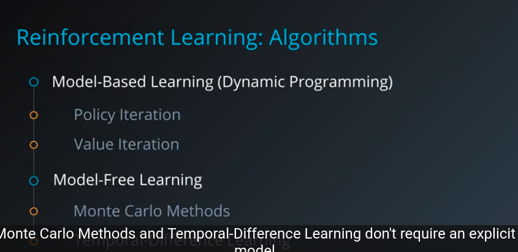
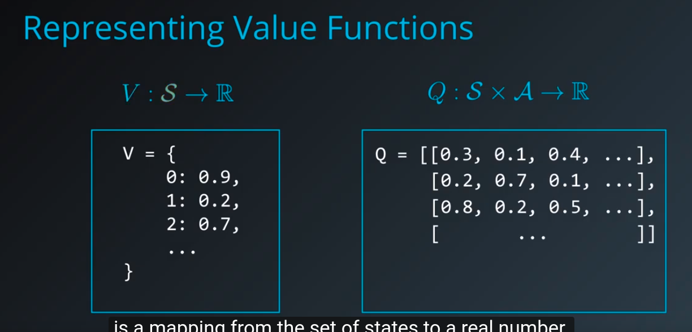
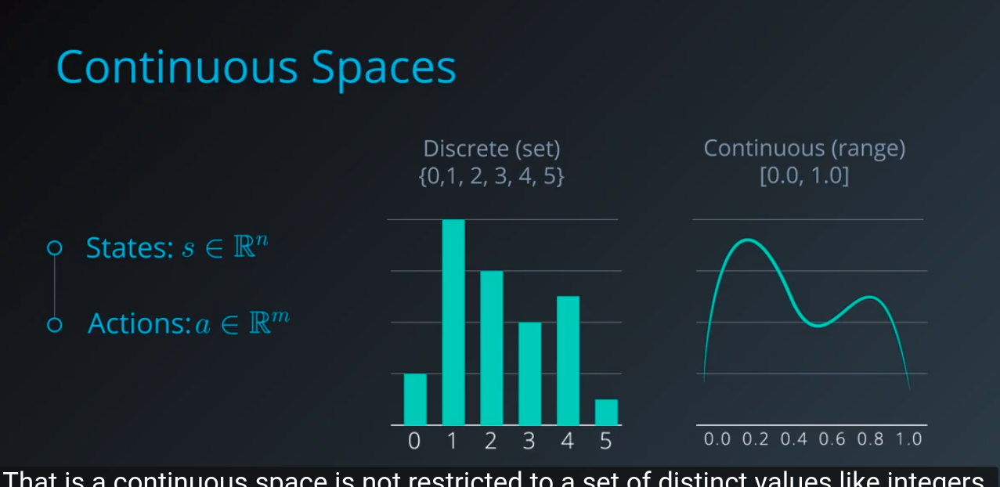
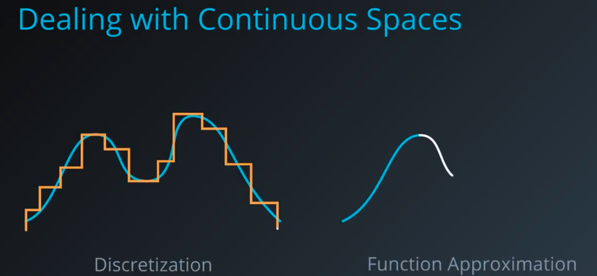
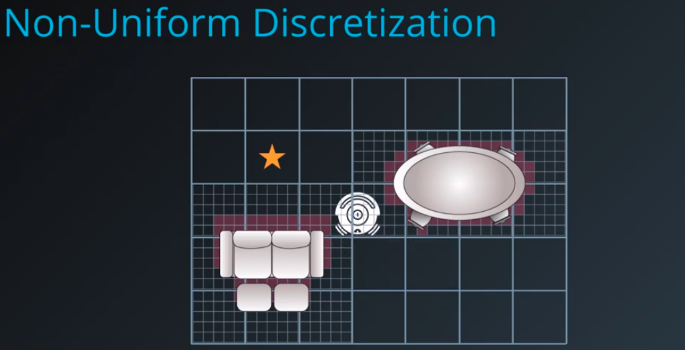
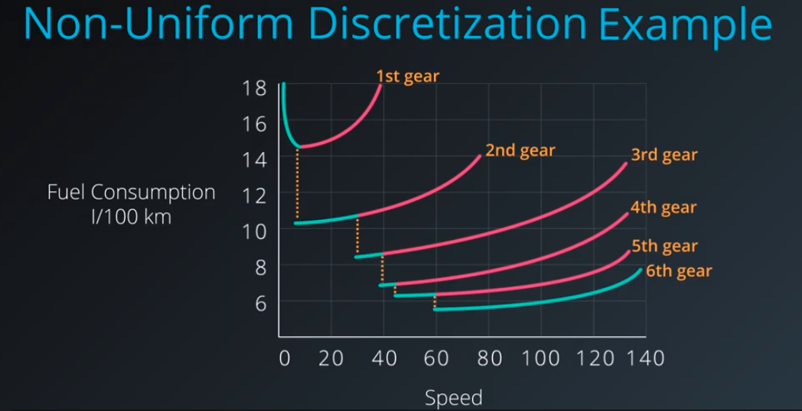

# 	RL in continuous Spac

### recap:





In this module we will learn how to generalize RL of discrete state-action values to continuous one:

* Deep Q-Learning
* policy gradients
  * actor-critic methods (mix the best of both worlds)


### Discrete vs. Continuous Spaces






Two main stratagies for coping with continuous space that we will be looking at are:




### Discretization

Enables us to use existing algorithms with little or no modifications.







#### Workshop Discretization

the files are in git...

def create_uniform_grid(low, high, bins=(10, 10)):
    """Define a uniformly-spaced grid that can be used to discretize a space."""
    return [np.linspace(low[0],high[0],bins[0])[1:-1],np.linspace(low[1],high[1],bins[1])[1:-1]]

```
def discretize(sample, grid):
    """Discretize a sample as per given grid."""
    return [np.digitize(sample[0], grid[0]), np.digitize(sample[1], grid[1])]
```

state_grid_new = create_uniform_grid(env.observation_space.low, env.observation_space.high, bins=(14, 14))

```


```

