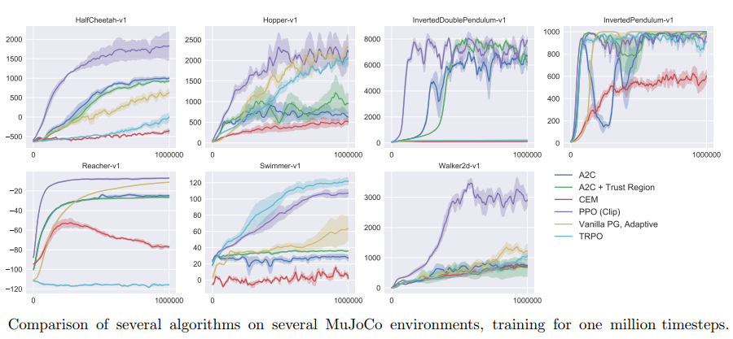

# Project report


After encountering the paper [Proximal Policy Optimization Algorithms](https://arxiv.org/pdf/1707.06347.pdf) which shows fast convergence of PPO on reacher environment, I chose to use PPO for solving the reacher environment.

 


The implementation is based off of [ShangtongZhang](https://github.com/ShangtongZhang) git repository.

The hyper-parameters were basically untouched and met the basis explained in [PPO Hyperparameters and Ranges](https://medium.com/@aureliantactics).

Actor-critic network sizes were based on the implementation of  [Jeremi Kaczmarczyk](https://github.com/jknthn/reacher-ppo.git).

<u>**Actor:**</u>

Network:

state 33 --> 33 to 512 (FC) --> relu --> 512 to 512 (FC) --> relu --> 512 to 4 (FC) --> tanh

The network yields expected action (ea).

The expected action along with agents std tensor constructs a Normal distribution of N(ea, std) from which the following is obtained:

```
action, log_prob, dist.entropy()
```

**<u>Critic</u>**

Network:

state 33 --> 33 to 512 (FC) --> relu --> 512 to 512 (FC) --> relu --> 512 to 1 (FC)

The network yields a the value of the given state ```v```.


<u>PPO implementation:</u>

1. Interact with environment for 'rollout_length':

   1. For each time step Use state and actor-critic networks to obtain actions and values
   2. Use the predicted actions to advance environment. Obtaining next states, rewards and terminals
   3. Append [states, values, actions, log_probs, rewars, not(dones)] into rollout list
   4. Repeat with state = next state

2.  Process rollout to obtain advantages instead of values and returns instead of rewards:

   Run on rollout from end-1 to start

   1. returns[i] = rewards[i] + gamma * returns[i+1] * not(dones)[i]
   2. td_error = rewards[i] + gamma * values[i+1] * not(dones)[i] - values[i]
   3. advantages[i] = advantages[i+1] * gae_tau * gamma * not(dones)[i] + td_error
   4. Append [states, actions, log_probs, returns, advantages] into processed_rollout

3. Go aver all processed_rollout in minibatches while optimizing the networks for minimum loss:

   1. Split all experience (processed_rollout) into 'mini_batch_number' minibatches.
   2. Use actor-critic network and (states, actions) to obtain (log_probs, entropy_loss, values)
   3. Calculate action probability ratio (and clipped ratio) using log_probs and previous log_probs.
   4. Calculate objective be multiplying ratio with advantages and multiplying by -1 (for minimization).
   5. Policy_Loss is basically the average of advantages * ratio
   6. Value_Loss is the average squared error between values and discounted returns.
   7. Optimization step towards reducing (policy_loss + value_loss)


The above obtained the following learning performance:


More Sources:


https://arxiv.org/pdf/1506.02438.pdf

https://arxiv.org/pdf/1804.03720.pdf

https://arxiv.org/pdf/1707.06347.pdf